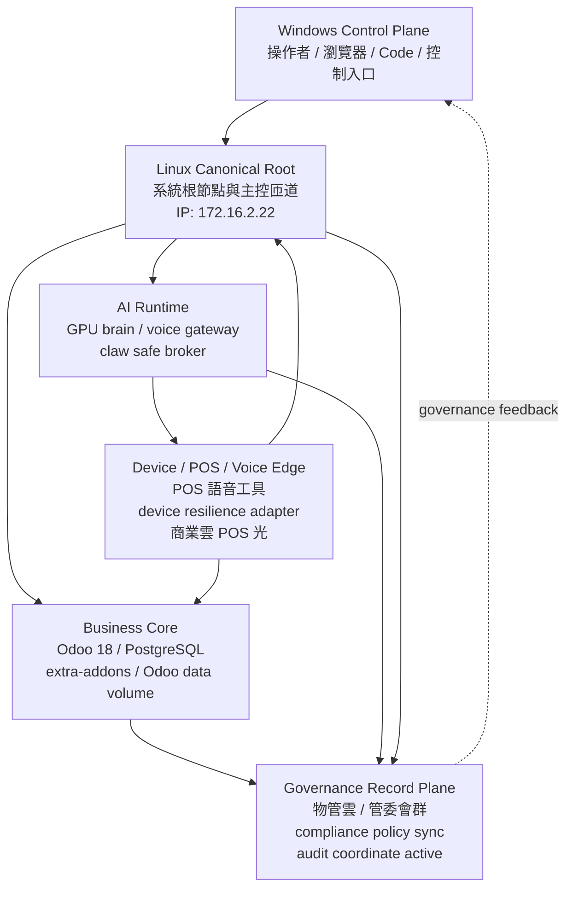
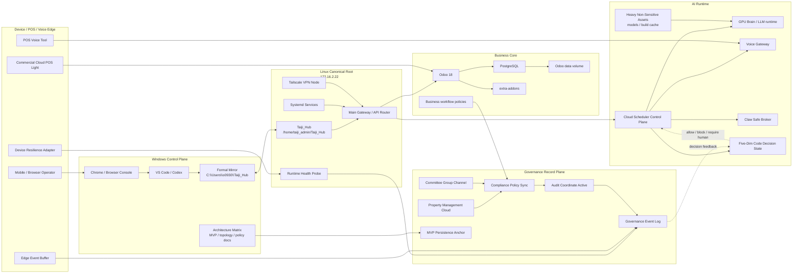

# 五常太極營運拓樸圖 v0.2

created_at: 2026-05-18T11:03:38+08:00
classification: non_secret_operational_topology
status: architecture_governance_record

## 核心判讀

五常太極營運拓樸 v0.2 將系統分成五個營運平面：Windows 控制平面、Linux 正典根節點、商業核心、AI Runtime、治理紀錄平面。另有 Device / POS / Voice Edge 作為現場與裝置邊緣層。

## 拓樸層級

| 平面 | 角色 | 主要組件 | 工程定位 |
| --- | --- | --- | --- |
| Windows Control Plane | 操作者與控制入口 | 瀏覽器、Code、控制入口 | 人類操作、管理 UI、架構整理、正式鏡像 |
| Linux Canonical Root | 系統根節點與主控匝道 | /home/taiji_admin/Taiji_Hub、主控 gateway、IP 172.16.2.22 | Linux-native runtime 主線、服務啟動、節點治理 |
| Business Core | 商業資料與流程核心 | Odoo 18、PostgreSQL、extra-addons、Odoo data volume | 商業流程、資料庫、ERP/物管/會員營運核心 |
| AI Runtime | AI 執行層 | GPU brain、voice gateway、claw safe broker | AI 推理、語音入口、安全 broker、任務調度候選 |
| Device / POS / Voice Edge | 現場裝置與語音邊緣 | POS 語音工具、device resilience adapter、商業雲 POS 光 | 現場輸入、POS/語音互動、裝置韌性與回報 |
| Governance Record Plane | 治理紀錄與合規同步 | 物管雲、管委會群、compliance policy sync、audit coordinate active | 稽核、政策同步、治理事件、合規證據鏈 |

## Mermaid 拓樸圖



## 模組區塊圖



## 模組填入表

| 區塊 | 模組 | 狀態 | 敏感度 | MVP 用途 |
| --- | --- | --- | --- | --- |
| Windows Control Plane | Chrome / Browser Console | active | L1 | Tailscale、Odoo、dashboard、人工操作入口 |
| Windows Control Plane | VS Code / Codex | active | L1 | 架構整理、檔案比對、文件同步 |
| Windows Control Plane | Formal Mirror | active | L1 | 乾淨架構、治理、schema、deploy reference |
| Linux Canonical Root | `/home/taiji_admin/Taiji_Hub` | primary | L1/L2 | Linux-native MVP 主倉 |
| Linux Canonical Root | Main Gateway / API Router | candidate | L2 | 對內服務路由、runtime 入口 |
| Linux Canonical Root | Systemd Services | active evidence | L2 | 關機後恢復與服務啟停 |
| Linux Canonical Root | Tailscale VPN Node | active evidence | L2 | VPN 節點網格與遠端節點連線 |
| Business Core | Odoo 18 | candidate/active | L3 | 商業流程、物管與會員流程 |
| Business Core | PostgreSQL | sensitive volume | L3 | Odoo/商業資料核心，不進 formal Hub |
| Business Core | extra-addons | candidate | L2 | 商業流程擴充模組 |
| AI Runtime | GPU Brain / LLM runtime | candidate | L1/L2 | 推理、任務輔助、heavy asset 掛載 |
| AI Runtime | Voice Gateway | candidate | L2/L3 | 語音入口，需檢查是否含個資/現場資料 |
| AI Runtime | Claw Safe Broker | candidate | L2 | 安全 broker、動作前治理檢查 |
| AI Runtime | Cloud Scheduler Control Plane | design | L2/L3 | 節點選擇、容器喚醒、任務調度 |
| AI Runtime | Five-Dim Code Decision State | design | L1 | 任務決策格式，收斂 allow/block/human decision |
| Device / POS / Voice Edge | POS Voice Tool | candidate | L2/L3 | 現場 POS 與語音輸入 |
| Device / POS / Voice Edge | Device Resilience Adapter | candidate | L2 | 裝置狀態與恢復能力 |
| Device / POS / Voice Edge | Commercial Cloud POS Light | design | L2/L3 | 輕量商業 POS 雲端同步 |
| Governance Record Plane | Compliance Policy Sync | design | L1/L2 | 政策同步與治理約束 |
| Governance Record Plane | Audit Coordinate Active | active evidence | L1/L2 | 稽核座標與事件紀錄 |
| Governance Record Plane | MVP Persistence Anchor | active | L0/L1 | 關機後續航錨點 |

## MVP 使用規則

1. Windows Control Plane 只能作為操作與 formal mirror，不直接承載 secrets 或 live volume。
2. Linux Canonical Root 是主 runtime 與服務啟動點，優先承接 Linux-native 掃描、diff、測試與部署。
3. Business Core 的 PostgreSQL 與 Odoo data volume 屬於高敏資料層，不納入 formal Hub，不作為無敏 heavy asset。
4. AI Runtime 可掛載 heavy non-sensitive assets，例如公開或可重建模型檔；但 voice/session/log 必須先判斷敏感度。
5. Device / POS / Voice Edge 的輸入資料可能含現場與會員資訊，預設中高敏，需經治理事件記錄。
6. Governance Record Plane 儲存政策、稽核摘要、合規同步狀態，不儲存明文秘密。

## Business Core 單一實例規則

Odoo 18 與 PostgreSQL 屬於同一個 Business Core，不可在 Windows Hub、WSL Hub、legacy core 或 live root 中各自啟動獨立正式資料實例。

唯一正式形態：

```text
shared_business_container_group
  - odoo_18
  - postgresql
  - extra_addons
  - odoo_data_volume
  - filestore/session volume
```

四夾中的 Odoo 相關資料只能分成三類：

| 類型 | 可放位置 | 可否多份 | 說明 |
| --- | --- | ---: | --- |
| compose/template | Windows Hub、WSL Hub | 可以 | 非敏感規格，可比對版本 |
| extra-addons source | Windows Hub、WSL Hub、legacy reference | 可以 | 程式碼可多份，但需選主來源 |
| live DB/data volume | 共用容器組 | 不可以 | 只能一份正式資料實例 |

Odoo data volume、PostgreSQL volume、sessions、filestore 預設 L3，不進 formal mirror，不進 heavy non-sensitive assets。

## 與四夾模型對應

| 四夾位置 | 對應平面 |
| --- | --- |
| /home/taiji_admin/Taiji_Hub | Linux Canonical Root、AI Runtime、Device/POS/Voice Edge 部分 |
| C:\Users\o0930\Taiji_Hub | Windows Control Plane 的 formal mirror |
| C:\wuchang_8_0_core | Business/AI/Edge 的 legacy engine source |
| /home/taiji_admin | live evidence root，含 systemd/Ollama/Caddy/audit 等運行證據 |

## 安全邊界

本檔只描述非敏感拓樸與工程角色。不記錄 Tailscale auth key、SSH private key、DB password、service account JSON、OAuth token、會員資料、語音原始資料或 runtime volume 內容。
