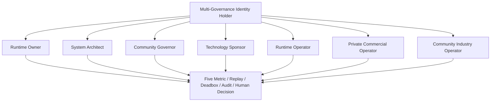

# Multi-Governance Identity Holder

## Identity Separation

The same natural person may hold multiple governance identities, but runtime must treat them as separate authority vectors.

## Forbidden Collapse

The system must not collapse these roles into one super-admin. Any role confusion that can affect assets, data, accounting, or production mutation is at least `L2_drift`; asset privatization or governance bypass is `L3_metric_hazard`.
