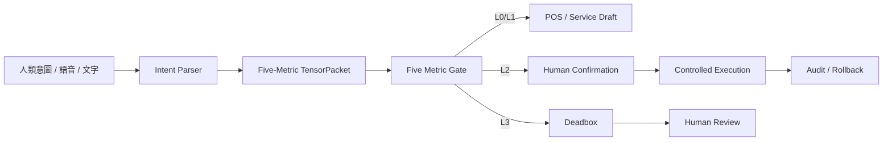

# Taiji Hub 圖塊式完成度更新

更新日期：2026-05-11  
更新模式：治理式本地進度盤點  
驗證邊界：不讀取 secret、不啟動服務、不執行部署、不呼叫外部 API  

## 總覽

| 模組 | 完成度 | 狀態 | 證據層級 | 下一步 |
|---|---:|---|---|---|
| 五維張量形式記法 Runtime | 85% | ████████░░ | 已建立 schema / validator / tests，使用者回報 pytest 通過 | 接入實際 Gateway runtime |
| 保守新增部署包 v0.1.0 | 75% | ███████░░░ | 已生成 package / Docker / systemd / rollback / hash script | 本機執行 preflight 與 hash |
| Natural Intent POS Gateway | 65% | ██████░░░░ | 已建立文件、schema、intent manifests | 補齊 policy runtime 與 POS 草稿接線 |
| Replay / Deadbox / Plaintext-Free Governance | 70% | ███████░░░ | 已建立治理規格與 runtime 文件 | 接入執行期 packet 狀態儲存 |
| Multi-Governance Identity | 80% | ████████░░ | 已建立身份架構、邊界矩陣、Odoo 對應模型 | 與 Odoo company/branch/customer 設定對表 |
| Odoo 場景主系統 | 45% | ████░░░░░░ | 已定義治理模型與資料庫統一方向 | 需容器實測、DB=odoo、dbfilter 驗證 |
| Google Workspace 無敏帳戶治理 | 35% | ███░░░░░░░ | 已定義邊界，不執行 live API | 需管理員人工確認 scope / OU / service account |
| Tailscale / VPN 節點治理 | 40% | ████░░░░░░ | 已提供節點資訊與 taiji_01 目標 | 需 read-only status / route / allowlist 驗證 |
| Runtime Deployment 實際啟動 | 20% | ██░░░░░░░░ | artifacts 已產生，但未啟動 | 手動執行 preflight 後再啟動 |
| Audit / Rollback | 75% | ███████░░░ | 多數新檔已有 audit/rollback 設計 | 補 SHA256 baseline |

## 圖塊進度

```text
五維張量 Runtime          [████████░░] 85%
部署 Artifact v0.1.0     [███████░░░] 75%
POS 自然語意閘道器       [██████░░░░] 65%
Replay / Deadbox         [███████░░░] 70%
多重治理身份             [████████░░] 80%
Odoo 主場景              [████░░░░░░] 45%
Google 無敏治理          [███░░░░░░░] 35%
VPN / Tailscale          [████░░░░░░] 40%
Runtime 實際啟動         [██░░░░░░░░] 20%
Audit / Rollback         [███████░░░] 75%
```

## 系統層級完成度

### L0 已可確認

| 項目 | 狀態 |
|---|---|
| formal tensor packet schema | 完成 |
| formal tensor validator | 完成 |
| validator pytest | 使用者回報通過 |
| runtime adapter fail-closed | 完成 |
| localhost bind by default | 完成 |
| `/health` endpoint | 完成 |
| `/tensor/validate` endpoint | 完成 |
| `/tensor/route` endpoint | 完成 |
| rollback script | 完成 |
| hash script | 完成，但 hash 尚待本地執行 |

### L1 可進入本地驗證

| 項目 | 狀態 |
|---|---|
| Docker compose package | 可本地驗證 |
| systemd unit package | 可本地驗證 |
| local start/stop scripts | 可本地驗證 |
| audit JSONL output | 可本地驗證 |
| deadbox routing | 可本地驗證 |
| replay_safe=false blocking | 可本地驗證 |

### L2 需補強後才能接 production

| 項目 | 風險 |
|---|---|
| Odoo 實際資料庫連線 | 需確認 DB=odoo、dbfilter、no database manager |
| POS production mutation | 必須 draft-first + human confirmation |
| Google Workspace API | 僅能無敏帳戶治理，需 scope/OU/service account 邊界 |
| Tailscale node deployment | 需 host allowlist / known_hosts / preflight |
| Browser runtime | 不得使用 admin session 直接改高權限設定 |

### L3 目前仍封鎖

| 項目 | 封鎖原因 |
|---|---|
| payment_execute | 必須人類決策與正式金流治理 |
| refund / discount override | 需財務與會計分窗 |
| manager_override | 高權限行為，不可由自然語言直達 |
| credential issuance | 憑證核發需人類決策 |
| production overwrite | 需 Gateway / Five Metric / audit / rollback / approval |
| secret/token/service account JSON 輸出 | 永久禁止明文輸出 |
| 0.0.0.0 unrestricted exposure | 必須經 Gateway / Tunnel / Reverse Proxy |

## 架構圖塊



## 本次完成度結論

目前 Taiji Hub 已從「概念治理文件」推進到「可部署 Runtime Artifact」階段，但尚未進入 production 啟動。  

最適合的下一步是本機手動執行：

```bash
bash deploy/packages/taiji_formal_tensor_runtime_v0_1_0/PREFLIGHT.sh
bash deploy/packages/taiji_formal_tensor_runtime_v0_1_0/HASH_SCRIPT.sh
```

完成後再決定是否啟動 local runtime：

```bash
bash deploy/packages/taiji_formal_tensor_runtime_v0_1_0/START_LOCAL.sh
bash deploy/packages/taiji_formal_tensor_runtime_v0_1_0/HEALTH.sh
```

