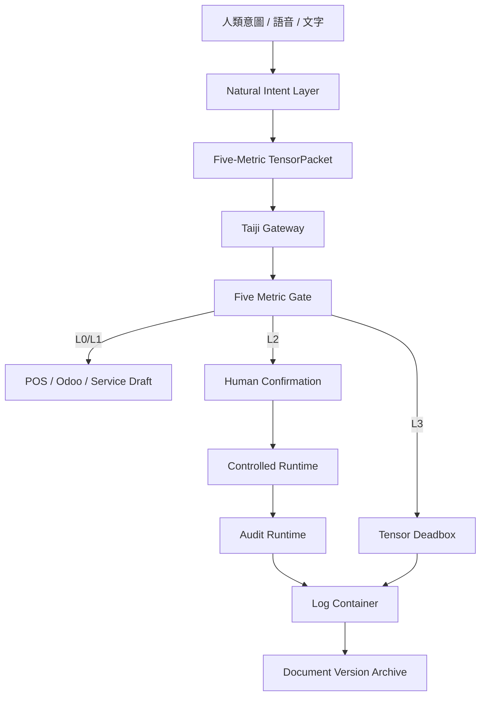

# Taiji Hub 架構與完成度總覽看板

版本：2026-05-11  
狀態：新版圖塊式總覽  
資料治理：不保存會員個別進度，只保存整份文件時間版本、封存、SHA256、audit、rollback reference  
執行邊界：本文件為治理看板，不啟動容器、不部署、不呼叫外部 API、不讀取 secret  

## 1. 系統總體圖塊

```text
┌──────────────────────────────────────────────┐
│ Taiji Hub Five-Metric Runtime                │
│ 狀態：開發封裝中                              │
│ 完成度：███████░░░ 72%                       │
└──────────────────────────────────────────────┘

┌──────────────┬──────────────┬──────────────┐
│ Runtime Core │ Odoo Scene   │ POS Service  │
│ ████████░░   │ ████░░░░░░   │ ██████░░░░   │
│ 80%          │ 45%          │ 65%          │
└──────────────┴──────────────┴──────────────┘

┌──────────────┬──────────────┬──────────────┐
│ Gateway      │ Log/Audit    │ Replay/Deadbox│
│ ███████░░░   │ ███████░░░   │ ███████░░░   │
│ 75%          │ 75%          │ 70%          │
└──────────────┴──────────────┴──────────────┘

┌──────────────┬──────────────┬──────────────┐
│ Google No-PII│ VPN/Tailscale│ Deployment   │
│ ███░░░░░░░   │ ████░░░░░░   │ ███████░░░   │
│ 35%          │ 40%          │ 75%          │
└──────────────┴──────────────┴──────────────┘
```

## 2. 架構主線



## 3. 日誌容器新版納入範圍

日誌容器在本看板中定義為治理觀測層，不保存會員個別進度。

| 日誌類型 | 建議路徑 | 狀態 | 用途 | 個資策略 |
|---|---|---|---|---|
| governance audit | `Taiji_Governance/logs/audit.log` | 已存在於治理設計 | 記錄治理事件 | 不寫會員進度 |
| system journal | `Taiji_Governance/syslog/system_journal.log` | 需本地確認 | 系統觀測摘要 | 不寫會員進度 |
| deployment audit | `.taiji_runtime*/audit/*.jsonl` | artifact 已設計 | Runtime 啟動/路由/驗證 | packet hash 優先 |
| runtime package audit | `deploy/packages/*` 對應 state audit | artifact 已設計 | 部署包事件 | 不含 secret |
| document archive audit | 文件封存索引 | 新政策已建立 | 文件版本封存 | 文件層，不是會員層 |

## 4. 完成度矩陣

| 模組 | 完成度 | 等級 | 目前成果 | 阻塞點 |
|---|---:|---|---|---|
| Five-Metric Formal Tensor Runtime | 85% | L1 | schema / validator / test / runtime package | 需實機 preflight/hash |
| Runtime Adapter Fail-Closed | 90% | L1 | validator import + fail-closed fallback | 需 endpoint 實測 |
| Deployment Package v0.1.0 | 75% | L1 | Docker/systemd/local scripts/rollback/hash script | 未實際啟動 |
| Log Container Governance | 70% | L1 | audit/syslog/deployment audit 架構已定義 | 需統一索引與 SHA256 |
| Document Version Archive | 80% | L1 | 禁止會員進度，改文件封存 | 需封存索引落地 |
| Natural Intent POS Gateway | 65% | L2 | schema/manifests/docs | policy 與 POS draft 接線未完成 |
| Odoo 主場景 | 45% | L2 | 身份/Odoo 模型已定義 | DB/容器狀態需 read-only 驗證 |
| Google Workspace No-PII | 35% | L2 | 權限邊界已定義 | scope/OU/service account 尚未實機核對 |
| VPN/Tailscale taiji_01 | 40% | L2 | 節點資訊已提供 | status/route/allowlist 需 read-only 驗證 |
| Payment / Refund / Manager Override | 0% | L3 | 明確封鎖 | 須人類決策、財務分窗、正式治理 |

## 5. 日誌容器資料規格

允許記錄：

```json
{
  "ts": "2026-05-11T00:00:00+08:00",
  "event": "runtime_event",
  "packet_hash": "sha256:<hash>",
  "document_version": "2026-05-11_v01",
  "risk_level": "L1",
  "action": "allow_with_audit",
  "secret_material": "not_accessed",
  "contains_member_progress": false,
  "contains_personal_data": false
}
```

禁止記錄：

```text
會員個別進度
會員姓名/電話/Email/住址
service account JSON 明文
OAuth token
API key
private key
password
browser cookie
可逆推出個人的 tensor label / vector label / hash label
```

## 6. 新版部署包對應

| 套件 | 路徑 | 狀態 |
|---|---|---|
| conservative runtime package | `deploy/packages/taiji_formal_tensor_runtime_v0_1_0/` | 已產生 |
| runtime adapter | `runtime_adapters/taiji_formal_tensor_runtime_v0_1_0_adapter.py` | 已產生 |
| manifest | `deploy/packages/taiji_formal_tensor_runtime_v0_1_0/MANIFEST.json` | 已產生 |
| rollback | `deploy/packages/taiji_formal_tensor_runtime_v0_1_0/ROLLBACK.sh` | 已產生 |
| hash script | `deploy/packages/taiji_formal_tensor_runtime_v0_1_0/HASH_SCRIPT.sh` | 已產生，待本地執行 |

## 7. 下一步安全命令

只列可回滾或 read-only / local verification 指令：

```bash
bash deploy/packages/taiji_formal_tensor_runtime_v0_1_0/PREFLIGHT.sh
bash deploy/packages/taiji_formal_tensor_runtime_v0_1_0/HASH_SCRIPT.sh
bash deploy/packages/taiji_formal_tensor_runtime_v0_1_0/START_LOCAL.sh
bash deploy/packages/taiji_formal_tensor_runtime_v0_1_0/HEALTH.sh
bash deploy/packages/taiji_formal_tensor_runtime_v0_1_0/STOP_LOCAL.sh
```

Docker 啟動需人工確認後再執行：

```bash
docker compose -f deploy/packages/taiji_formal_tensor_runtime_v0_1_0/docker-compose.yml up -d --build
```

## 8. 禁止動作

```text
不得輸出 secret / token / service account JSON / private key / password
不得保存會員個別進度
不得直接寫入 production Odoo
不得 payment_execute
不得 refund / discount override / manager_override
不得使用自然語言直接 mutate production
不得未經 Gateway / Five Metric / Audit / Rollback 啟動外部入口
不得 0.0.0.0 unrestricted exposure
```

## 9. 總結

Taiji Hub 目前已進入「可部署 Runtime Artifact + 治理圖塊看板」階段。

系統尚未進入 production runtime；目前最佳狀態是：

```text
設計收斂完成度：高
部署 artifact 完成度：中高
實機啟動驗證：待執行
Odoo / Google / VPN 實接：待 read-only 驗證
會員進度保存：禁止
文件版本封存：採用
```

