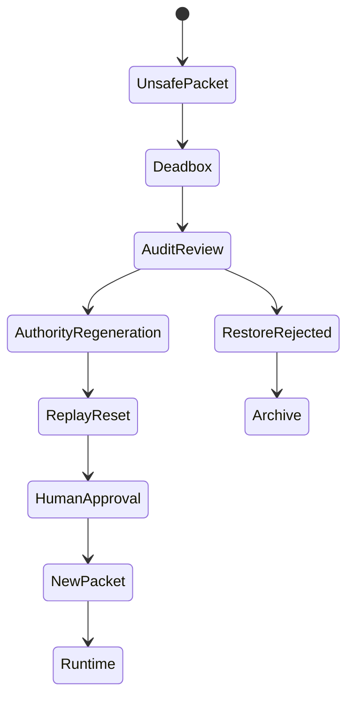

# Deadbox Lifecycle

```mermaid
stateDiagram-v2
    [*] --> UnsafePacket
    UnsafePacket --> Deadbox
    Deadbox --> AuditReview
    AuditReview --> RestoreRejected
    AuditReview --> AuthorityRegeneration
    AuthorityRegeneration --> ReplayReset
    ReplayReset --> HumanApproval
    HumanApproval --> NewPacket
    NewPacket --> Runtime
    RestoreRejected --> Archive
```
