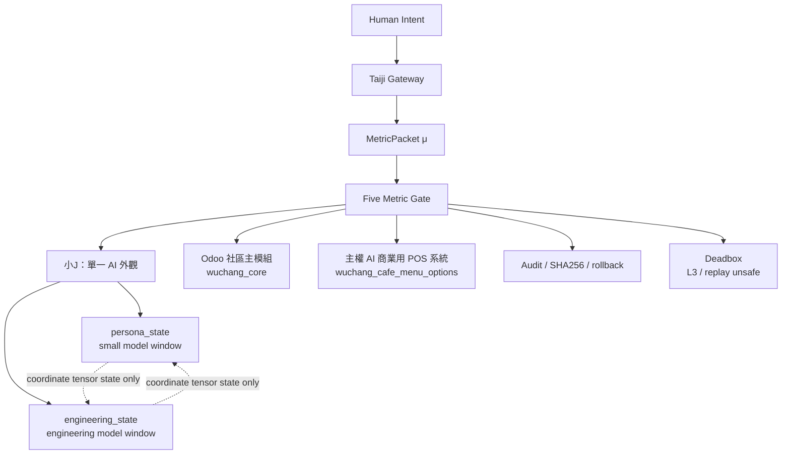

# Taiji Runtime 架構映射

## 節點映射

| 節點 | 工程角色 | 現況 |
| --- | --- | --- |
| MSI | 開發者設備 / orchestration node | Linux workspace active |
| taiji01 | 主系統節點 / governance edge | 已記錄雙身分與寫入邊界 |
| Odoo | 社區主模組與 POS 主場景 | `wuchang_core`、`wuchang_cafe_menu_options` 已找到 |
| Ollama | 小J內部模型窗位承載 | 多模型可用，外觀仍為一座小J |
| ContainerMesh | 容器服務網 | 已盤點，需處理 exposed port 風險 |

## 模組映射

| 模組 | 主要檔案 | 用途 |
| --- | --- | --- |
| Odoo 社區主模組 | `Taiji_Odoo/addons/wuchang_core/__manifest__.py` | 許願樹、AI 2FA、ESG 沖銷原型 |
| 主權 AI 商業用 POS 系統 | `Taiji_Odoo/addons/wuchang_cafe_menu_options/models/menu_options.py` | 菜單選項、W5C code、POS 商品資料承接 |
| Formal Tensor Runtime | `deploy/packages/taiji_formal_tensor_runtime_v0_1_0/runtime_entry_v0_1_1.py` | 本地 fail-closed runtime |
| Intent Flow Cache | `runtime_adapters/intent_flow_cache_policy.py` | 五維碼快取、禁止明文個資 |
| 小J分窗路由 | `runtime/dual_state/ollama_dual_state_runtime.py` | 一座小J，內部分窗路由 |

