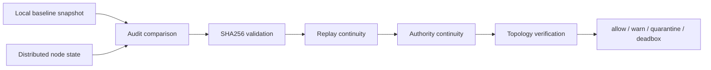

# Reconciliation Flow

```mermaid
flowchart LR
    SNAP["Local baseline snapshot"]
    NODE["Distributed node state"]
    AUDIT["Audit comparison"]
    HASH["SHA256 validation"]
    REPLAY["Replay continuity"]
    AUTH["Authority continuity"]
    TOPO["Topology verification"]
    ROUTE["allow / warn / quarantine / deadbox"]

    SNAP --> AUDIT
    NODE --> AUDIT
    AUDIT --> HASH --> REPLAY --> AUTH --> TOPO --> ROUTE
```
