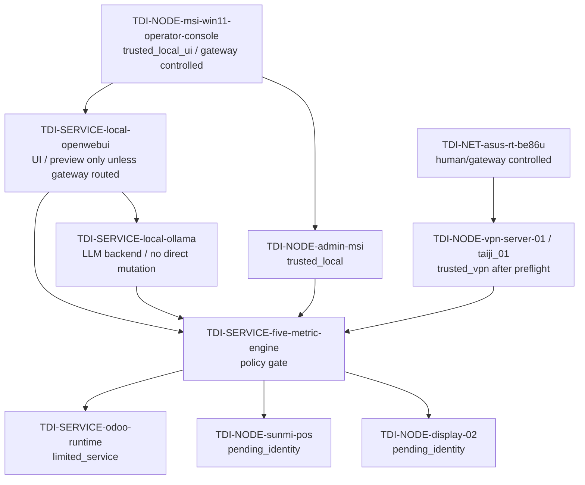

# Topology Trust Graph

```mermaid
flowchart TB
    MSI["TDI-NODE-admin-msi<br/>trusted_local"]
    WIN["TDI-NODE-msi-win11-operator-console<br/>trusted_local_ui / gateway controlled"]
    OLLAMA["TDI-SERVICE-local-ollama<br/>LLM backend / no direct mutation"]
    WEBUI["TDI-SERVICE-local-openwebui<br/>UI / preview only unless gateway routed"]
    TAIJI01["TDI-NODE-vpn-server-01 / taiji_01<br/>trusted_vpn after preflight"]
    ROUTER["TDI-NET-asus-rt-be86u<br/>human/gateway controlled"]
    ODOO["TDI-SERVICE-odoo-runtime<br/>limited_service"]
    POS["TDI-NODE-sunmi-pos<br/>pending_identity"]
    DISPLAY["TDI-NODE-display-02<br/>pending_identity"]
    FM["TDI-SERVICE-five-metric-engine<br/>policy gate"]

    WIN --> MSI
    WIN --> WEBUI
    WEBUI --> FM
    WEBUI --> OLLAMA
    OLLAMA --> FM
    MSI --> FM
    TAIJI01 --> FM
    ROUTER --> TAIJI01
    FM --> ODOO
    FM --> POS
    FM --> DISPLAY
```
