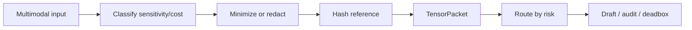

# Multimodal Tensor Flow

```mermaid
flowchart LR
    IN["Multimodal input"]
    CLASS["Classify sensitivity/cost"]
    MIN["Minimize or redact"]
    HASH["Hash reference"]
    PACKET["TensorPacket"]
    ROUTE["Route by risk"]
    OUT["Draft / audit / deadbox"]

    IN --> CLASS --> MIN --> HASH --> PACKET --> ROUTE --> OUT
```
