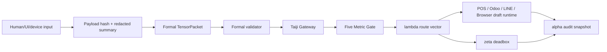

# Formal Tensor Event Flow

```mermaid
flowchart LR
    INPUT["Human/UI/device input"]
    HASH["Payload hash + redacted summary"]
    PACKET["Formal TensorPacket"]
    VALIDATOR["Formal validator"]
    GATEWAY["Taiji Gateway"]
    FM["Five Metric Gate"]
    ROUTE["lambda route vector"]
    TARGET["POS / Odoo / LINE / Browser draft runtime"]
    DEADBOX["zeta deadbox"]
    AUDIT["alpha audit snapshot"]

    INPUT --> HASH --> PACKET --> VALIDATOR --> GATEWAY --> FM --> ROUTE
    ROUTE --> TARGET --> AUDIT
    ROUTE --> DEADBOX --> AUDIT
```
