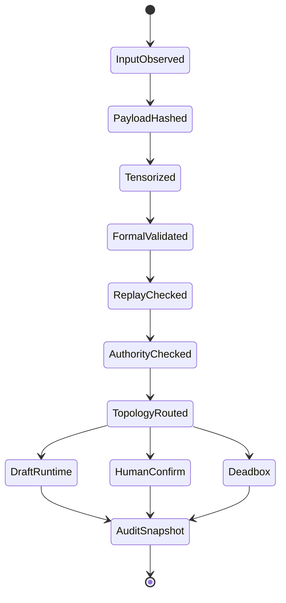

# Formal Tensor State Machine

```mermaid
stateDiagram-v2
    [*] --> InputObserved
    InputObserved --> PayloadHashed
    PayloadHashed --> Tensorized
    Tensorized --> FormalValidated
    FormalValidated --> ReplayChecked
    ReplayChecked --> AuthorityChecked
    AuthorityChecked --> TopologyRouted
    TopologyRouted --> DraftRuntime
    TopologyRouted --> HumanConfirm
    TopologyRouted --> Deadbox
    DraftRuntime --> AuditSnapshot
    HumanConfirm --> AuditSnapshot
    Deadbox --> AuditSnapshot
    AuditSnapshot --> [*]
```

No state may skip `FormalValidated`.
