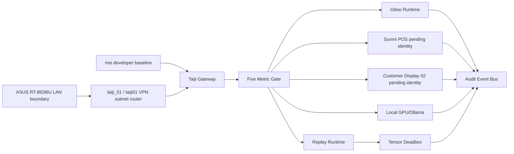

# Governance Runtime Topology Map

```mermaid
flowchart LR
    DEV["msi developer baseline"]
    TS["taiji_01 / taiji01 VPN subnet router"]
    ROUTER["ASUS RT-BE86U LAN boundary"]
    GATE["Taiji Gateway"]
    FM["Five Metric Gate"]
    ODOO["Odoo Runtime"]
    POS["Sunmi POS pending identity"]
    DISPLAY["Customer Display 02 pending identity"]
    GPU["Local GPU/Ollama"]
    AUDIT["Audit Event Bus"]
    REPLAY["Replay Runtime"]
    DEADBOX["Tensor Deadbox"]

    DEV --> GATE --> FM
    TS --> GATE
    ROUTER --> TS
    FM --> ODOO
    FM --> POS
    FM --> DISPLAY
    FM --> GPU
    FM --> REPLAY
    REPLAY --> DEADBOX
    ODOO --> AUDIT
    POS --> AUDIT
    DISPLAY --> AUDIT
    GPU --> AUDIT
    DEADBOX --> AUDIT
```
