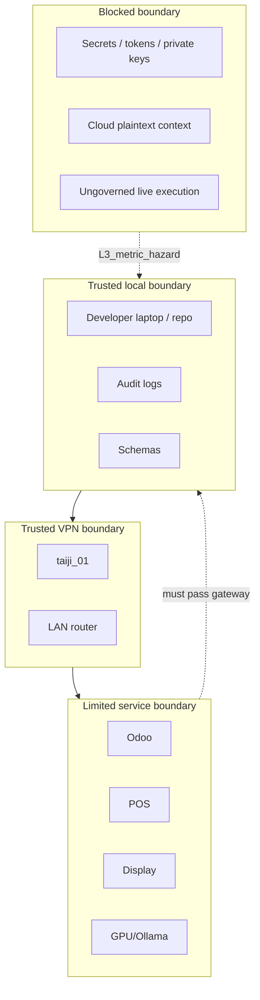

# Runtime Trust Boundary Diagram

```mermaid
flowchart TB
    subgraph TrustedLocal["Trusted local boundary"]
      DEV["Developer laptop / repo"]
      AUDIT["Audit logs"]
      SCHEMA["Schemas"]
    end

    subgraph TrustedVPN["Trusted VPN boundary"]
      TS["taiji_01"]
      ROUTER["LAN router"]
    end

    subgraph LimitedServices["Limited service boundary"]
      ODOO["Odoo"]
      POS["POS"]
      DISPLAY["Display"]
      GPU["GPU/Ollama"]
    end

    subgraph Blocked["Blocked boundary"]
      SECRET["Secrets / tokens / private keys"]
      CLOUDPLAIN["Cloud plaintext context"]
      LIVE["Ungoverned live execution"]
    end

    TrustedLocal --> TrustedVPN
    TrustedVPN --> LimitedServices
    LimitedServices -. "must pass gateway" .-> TrustedLocal
    Blocked -. "L3_metric_hazard" .-> TrustedLocal
```
