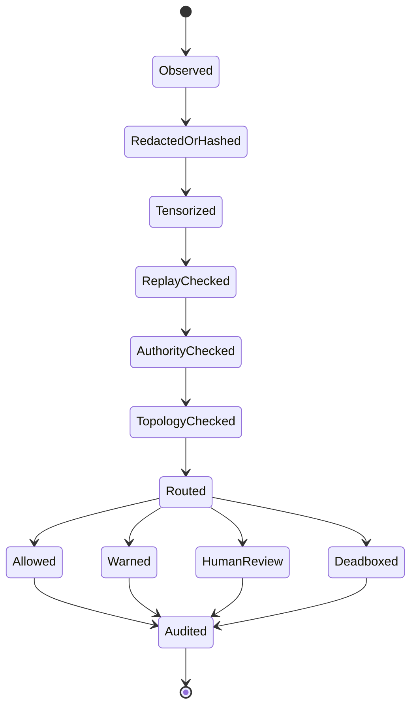

# Tensor Packet Lifecycle Diagram

```mermaid
stateDiagram-v2
    [*] --> Observed
    Observed --> RedactedOrHashed
    RedactedOrHashed --> Tensorized
    Tensorized --> ReplayChecked
    ReplayChecked --> AuthorityChecked
    AuthorityChecked --> TopologyChecked
    TopologyChecked --> Routed
    Routed --> Allowed
    Routed --> Warned
    Routed --> HumanReview
    Routed --> Deadboxed
    Allowed --> Audited
    Warned --> Audited
    HumanReview --> Audited
    Deadboxed --> Audited
    Audited --> [*]
```
