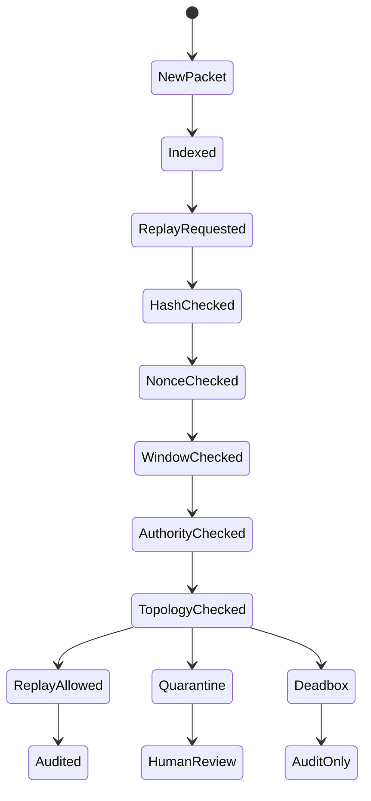

# Replay Lifecycle

```mermaid
stateDiagram-v2
    [*] --> NewPacket
    NewPacket --> Indexed
    Indexed --> ReplayRequested
    ReplayRequested --> HashChecked
    HashChecked --> NonceChecked
    NonceChecked --> WindowChecked
    WindowChecked --> AuthorityChecked
    AuthorityChecked --> TopologyChecked
    TopologyChecked --> ReplayAllowed
    TopologyChecked --> Quarantine
    TopologyChecked --> Deadbox
    ReplayAllowed --> Audited
    Quarantine --> HumanReview
    Deadbox --> AuditOnly
```
