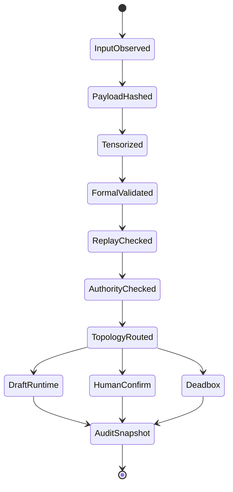
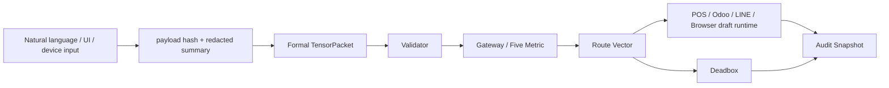

# Taiji Five-Metric Formal Notation Runtime

版本：0.1  
日期：2026-05-11  
狀態：形式記法 runtime 協議  
分類：非敏感 Runtime Protocol / Schema / Validator 規格

## 核心結論

Taiji Runtime 不以自然語言 prompt 作為主要傳輸格式。自然語言只作為人類解釋層、輸入層或摘要層。

Runtime 內部優先使用：

- YAML / JSON
- `TensorPacket`
- State Machine
- Event Flow
- Route Vector
- Continuity State
- Replay Metadata
- Audit Snapshot

POS 語音點餐、LINE 點餐、Odoo、Browser-Controlled AI Service、Gateway、Replay、Deadbox、Audit 與 Container Governance 都必須透過五維張量形式記法交換狀態。

## Canonical Symbols

| Symbol | Name | Meaning |
| --- | --- | --- |
| `tau` | Five-Metric Tensor State | 五維張量狀態 |
| `pi` | Payload | 輸入/請求 payload |
| `omega` | Result | 結果 |
| `mu` | Runtime Metadata | Runtime metadata |
| `sigma` | Continuity State | 連續性狀態 |
| `delta` | State Transition | 狀態轉移 |
| `lambda` | Route Vector | 路由向量 |
| `gamma` | Governance Vector | 治理向量 |
| `rho` | Replay Vector | Replay 向量 |
| `kappa` | Cache Vector | Cache 向量 |
| `epsilon` | Entropy / Usage Cost Vector | 熵與使用成本向量 |
| `zeta` | Deadbox State | Deadbox 狀態 |
| `alpha` | Audit Snapshot | Audit snapshot |

YAML/JSON 欄位採 ASCII 名稱以維持工具相容性；文件中可使用希臘符號作語意對照。

## tau 五維張量定義

`tau.I` Intent Metric:

- task purpose
- operation type
- modality: voice / text / image / video / POS / Odoo / LINE / browser
- examples: `order_create`, `order_modify`, `payment_prepare`, `browser_execute`, `ai_fallback`

`tau.R` Resource Metric:

- token cost
- GPU cost
- voice runtime cost
- browser automation cost
- network IO
- local cache cost
- multimodal retry cost

`tau.T` Time Metric:

- created_at
- replay_window_sec
- continuity_state
- session_lifetime
- rollback_horizon
- cache_ttl

`tau.A` Authority Metric:

- governance level
- human confirmation requirement
- payment boundary
- deployment boundary
- credential boundary
- production overwrite boundary

`tau.P` Topology Metric:

- source node
- gateway
- target runtime
- container scope
- domain route
- Odoo scope
- POS node
- LINE gateway
- browser runtime
- audit runtime

## Canonical TensorPacket

```yaml
TensorPacket:
  packet_id: tp_20260511T184500Z_ab12cd
  schema: taiji.formal_tensor_packet.v1
  tau:
    I:
      type: order_create
      modality: voice
      confidence: 0.96
      semantic_hash: sha256:0000000000000000000000000000000000000000000000000000000000000000
    R:
      ai_cost: low
      gpu_required: false
      voice_api_required: false
      browser_runtime_cost: low
      estimated_tokens: 32
      io_cost: low
    T:
      created_at: "2026-05-11T18:45:00+08:00"
      replay_window_sec: 30
      continuity_state: active
      cache_ttl_sec: 300
      rollback_horizon: discard_draft
    A:
      governance_level: L2_confirm
      human_confirmation_required: true
      payment_boundary: prepare_only
      deployment_boundary: no_live_deploy
      credential_boundary: no_credential_access
      production_overwrite_boundary: blocked
    P:
      source_node: TDI-NODE-sunmi-pos
      gateway: TDI-SERVICE-taiji-gateway
      target_runtime: pos_draft
      container_scope: cafe_pos_reopen
      domain_route: pos.wuchang.life
      odoo_scope: community_industry_branch
      pos_node: TDI-NODE-sunmi-pos
      line_gateway: none
      browser_runtime: none
      audit_runtime: taiji_audit
  pi:
    payload_hash: sha256:1111111111111111111111111111111111111111111111111111111111111111
    raw_plaintext_stored: false
    redacted_summary: "Hot beverage order draft."
  sigma:
    continuity: reuse
    tensor_hash: tx_91ae7f
    pattern: beverage_hot_standard
  lambda:
    route: gateway_to_pos_draft
    allowed_targets:
      - pos_draft
      - audit_runtime
  gamma:
    risk_level: L2
    action: warn
    human_decision: required
    audit_required: true
    rollback_required: true
  rho:
    nonce_hash: sha256:2222222222222222222222222222222222222222222222222222222222222222
    parent_hash: root
    replay_allowed: false
  kappa:
    cache_key: beverage_hot_standard
    cache_ttl_sec: 300
  epsilon:
    entropy_level: low
    retry_budget: 1
    gpu_wake_allowed: false
  zeta:
    deadbox_state: none
    deadbox_reason: none
  alpha:
    audit_event_id: audit_pending
    audit_channel: Taiji_Governance/logs/audit.log
    secret_material_printed: false
    external_api_called: false
    live_deploy_executed: false
```

## State Machine



## Event Flow



## Refactor Rules

1. Raw natural language may enter only as input, never as runtime protocol.
2. Gateway output must be a formal `TensorPacket`.
3. POS/Odoo/LINE/browser actions must consume packet fields, not raw text.
4. Payment, refund, credential issuance, production overwrite, destructive delete and manager override remain L3 unless a separate human-governed runtime exists.
5. `tx_91ae7f / beverage_hot_standard` is a continuity marker only; it does not authorize execution.
6. Browser-Controlled AI Service is a limited runtime target, not an admin bypass.
7. Audit snapshot is mandatory for L1+.

## Required Implementation Layers

- `schemas/formal_tensor_packet.schema.json`
- `Taiji_Governance/runtime/packet/formal_notation_protocol.yaml`
- `Taiji_Governance/runtime/packet/formal_tensor_state_machine.md`
- `Taiji_Governance/runtime/packet/formal_event_flow.md`
- `services/gateway/policies/formal_tensor_validator.py`
- `tests/test_formal_tensor_validator.py`

This layer is protocol-first and local-only until validators and tests pass.
