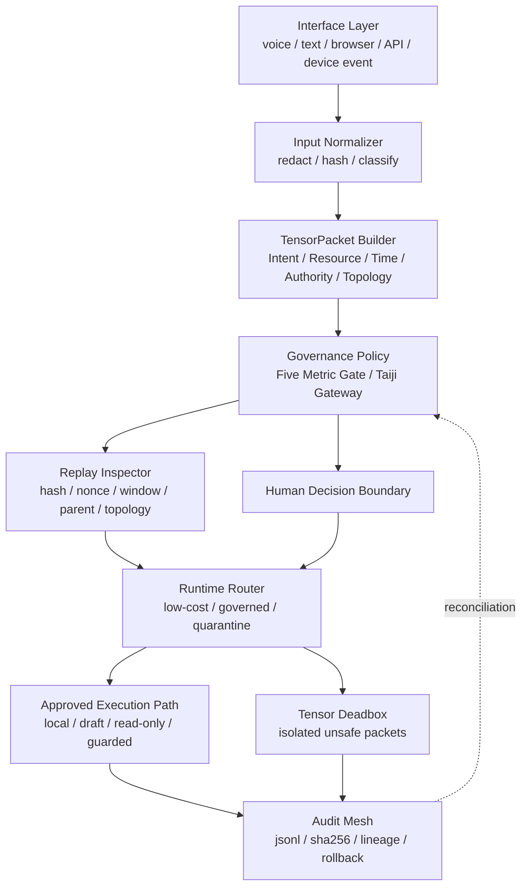
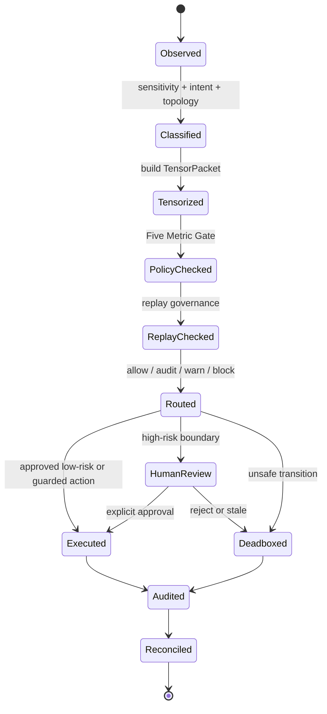
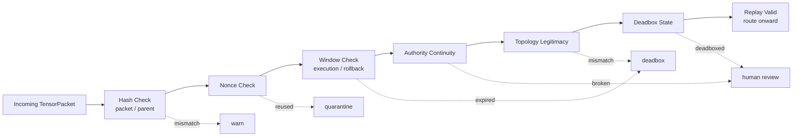
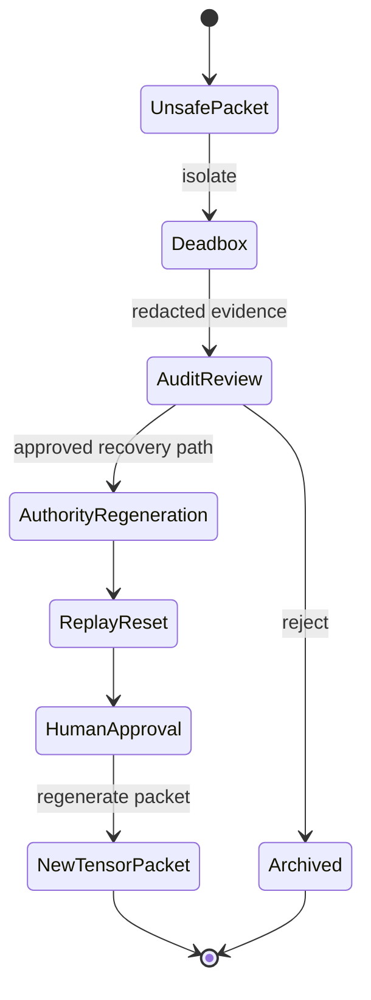
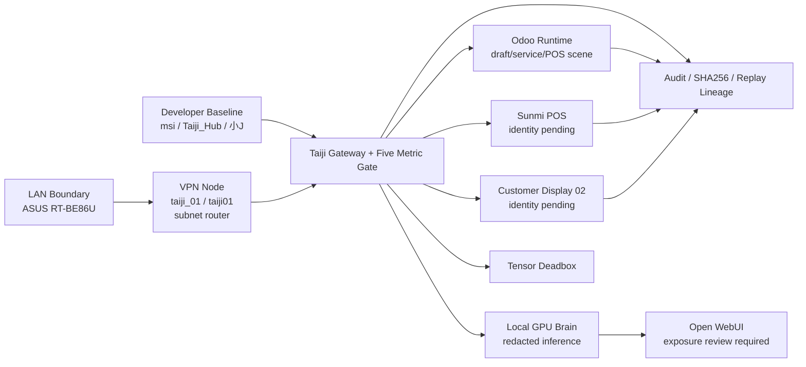
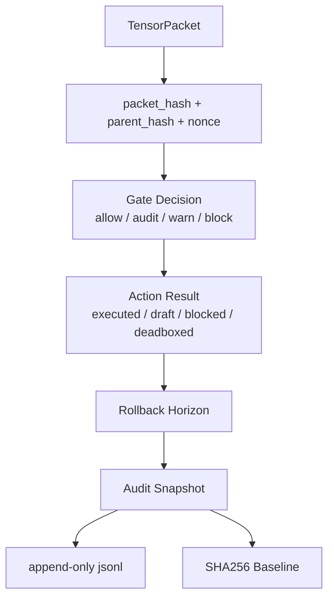
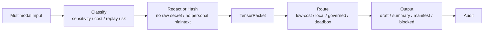

# Taiji Five-Metric Tensor Runtime

版本：0.1  
日期：2026-05-11  
狀態：治理式 runtime 規格  
分類：非敏感治理架構與 runtime schema 規格

## 目的

Taiji Five-Metric Tensor Runtime 是 Taiji Hub 的治理式張量執行世界。它不是聊天回覆規則，而是用五個度規向量來定義、治理、路由、稽核與保存所有 runtime 行為。

所有任務、設備、模型、封包、工作流、部署、多模態請求、治理行動與分散式節點，都必須先被轉換成 Five-Metric Tensor State，才可進入執行或審查。

AI 不是最高權限。AI 是在度規世界內運行的受治理執行體。

## 五度規基礎

| Metric | 中文定位 | 必要內容 |
| --- | --- | --- |
| Intent Metric | 意圖度規 | purpose、operational objective、governance classification、execution necessity |
| Resource Metric | 資源度規 | compute usage、token usage、GPU usage、multimodal generation cost、storage pressure、network consumption |
| Time Metric | 時間度規 | execution window、replay expiration、task lifetime、rollback horizon、synchronization timing、audit chronology |
| Authority Metric | 權限度規 | permission level、governance ownership、approval requirement、human decision requirement、escalation boundary |
| Topology Metric | 拓樸度規 | node location、routing structure、governance boundary、distributed relationship、device trust position、runtime adjacency |

## TensorPacket 結構

所有可執行狀態必須轉換為：

```text
TensorPacket {
  intent_vector,
  resource_vector,
  time_vector,
  authority_vector,
  topology_vector
}
```

不得有任何 executable operation 繞過 tensor conversion。

機器可讀 schema 位於：

- `schemas/tensor_packet.schema.json`

## Runtime 治理原則

Runtime 不由 conversational authority 管理，而由以下條件共同治理：

- tensor state
- governance policy
- replay validity
- topology legitimacy
- authority boundary
- resource safety
- audit continuity

對話語言只是介面層。真正的 runtime 核心是張量狀態、拓樸向量、權限向量、設備狀態、感測狀態、部署狀態、稽核狀態與治理狀態。

## Runtime 總圖



## Tensor Lifecycle



## Plaintext-Free Context Governance

Runtime 不應把 raw plaintext context 當作 unrestricted executable memory。應保存：

- tensor summaries
- packet hashes
- replay-safe references
- audit snapshots
- topology state
- governance summaries
- authority vectors
- execution lineage

Raw plaintext 不得：

- 成為無限制 runtime memory。
- 繞過 replay governance。
- 繞過 authority verification。
- 被送入外部 AI 或雲端 API 作為明文上下文。

## Replay Governance

Replay governance 適用於：

- prompt replay
- shell replay
- deployment replay
- payment replay
- multimodal replay
- deadbox replay
- stale topology replay

Replay inspection 必須確認：

- packet_hash
- parent_hash
- nonce
- execution window
- authority continuity
- topology legitimacy
- deadbox state



不安全 replay transition 可進入 `warn`、`quarantine`、`deadbox` 或 `human review`。

## Tensor Deadbox Lifecycle

Deadbox 是 unsafe execution packet 的張量治理隔離狀態。

Deadbox 條件：

- replay detected
- stale tensor state
- topology mismatch
- authority violation
- unsafe deployment
- plaintext exposure risk
- prompt injection risk
- governance drift
- execution drift

Deadbox 封包不得直接回到 runtime。它必須重新產生 authority、重置 replay、通過 audit review，並取得必要 human approval。



## AI Usage Governance

Taiji Runtime 的 AI 使用目標：

- lower entropy execution
- lower unnecessary model invocation
- lower multimodal retry
- lower context expansion
- lower repeated rendering
- lower unnecessary GPU wake-up
- lower deployment waste

但不可犧牲：

- governance correctness
- operational integrity
- acceptable quality threshold
- audit continuity

路由原則：

| 任務 | 路由 |
| --- | --- |
| L0 低熵 read-only | local deterministic path 或低成本模型 |
| L1 草稿、查詢、非敏 metadata | local policy + audit |
| L2 payment_prepare、confirmed order mutation、transaction reference | governed path + human confirmation + rollback note |
| L3 payment_execute、refund、credential issuance、production overwrite | deadbox 或 human-governed separate runtime |

## Distributed Governance Topology

分散式節點可繼續：

- authorized local runtime
- approved low-risk execution
- replay-safe local operations

分散式節點不得：

- override governance
- bypass replay governance
- issue credentials
- bypass deadbox
- alter tensor policy
- overwrite production runtime



Governance reconciliation 需要：

- audit comparison
- SHA256 baseline validation
- topology verification
- replay continuity validation
- authority continuity validation

## Human Decision Boundary

以下操作必須有人類決策：

- payment execution
- production overwrite
- destructive deletion
- credential issuance
- authority escalation
- governance override
- legal commitment
- external deployment approval

AI 可以協助分析、草擬、風險分級與產生 manifest，但不得自主 finalize。

## Audit Flow



## Multimodal Governance Workflow

多模態請求包含語音、圖片、PDF、文件、瀏覽器畫面、生成圖像、Odoo UI、POS UI 或設備狀態。



禁止：

- 將 Odoo 會員明文、Google 私人資料、service account JSON、OAuth token、private key 或 session cookie 放進多模態上下文。
- 將不可逆成本高的生成工作重複送出而無 audit。
- 以圖片或 hash label 形式可逆藏入個資或 secret。

## Runtime Enforcement

Runtime 不是文件。文件只負責治理可見性、audit traceability 與 operational observability。

Runtime 必須成為：

- governance operating system
- tensor execution environment
- replay-aware operational runtime
- plaintext-free governance layer
- multimodal routing system
- distributed audit-preserving topology

## Acceptance Criteria

- 每個 executable state 都有 TensorPacket。
- 每個 TensorPacket 都有 hash、parent、nonce、time window、authority vector 與 topology vector。
- L0/L1/L2/L3 都能映射到 allow/audit/warn/block/deadbox/human review。
- Raw plaintext 不成為 unrestricted runtime memory。
- Replay、stale topology、authority violation 可被 deadbox。
- 分散式節點不得繞過 Gateway/Five Metric。
- payment execution、production overwrite、credential issuance、authority escalation 必須有人類決策。
- audit jsonl、SHA256 baseline、rollback horizon 可追溯。

## Final Principle

Taiji Runtime 不追求無限制 AI 擴張。它追求：

- governed intelligence
- low-entropy execution
- operational conservation
- replay-resistant governance
- plaintext minimization
- topology-aware execution
- human-boundary-preserving AI operation

Taiji Runtime 必須表現為 Five-Metric Tensor Governance Operating System。
