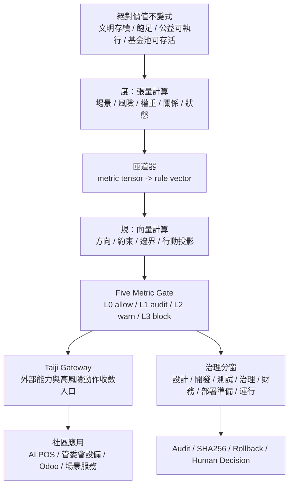
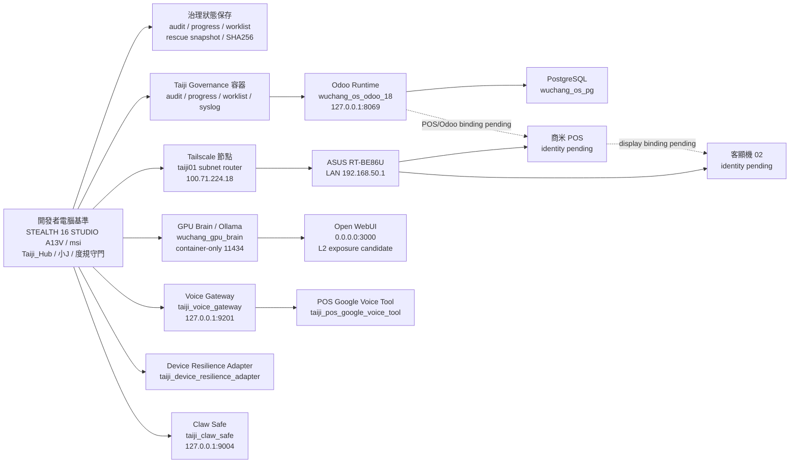

# Taiji Hub 架構與完成度總覽看板

版本：0.1  
日期：2026-05-11  
狀態：治理式完成度盤點  
分類：非敏感系統設計與進度文件

## 看板定義

本看板合併 Taiji Hub 的架構、模組項目、治理分窗、完成度與下一步缺口。完成度指「治理封裝完成度」，不是 production 上線率，也不是商業成熟度。

本次看板寫入前已完成只讀掃描：本地檔案、治理日誌、Docker 容器清單、Docker 映像清單、volume 清單、network 清單與 compose project 清單。掃描只取檔名、容器名、映像、狀態、ports 與非敏感 metadata；未讀取 env、未讀取 secret、未進入容器、未啟動或停止任何服務。

完成度判準：

- 是否有 repo 內可驗證檔案。
- 是否有非敏感文件與治理規則。
- 是否有本地測試或 preflight。
- 是否有 audit / SHA256 / rollback 思維。
- 是否仍存在 L2/L3 風險。
- 是否已避免雲端明文、secret 入庫與 live deployment。

完成度圖塊：

| 圖塊 | 區間 | 意義 |
| --- | --- | --- |
| `██░░░` | 0-20% | 概念或初始骨架 |
| `███░░` | 21-40% | 已有檔案但仍需治理封裝 |
| `████░` | 41-70% | 可本地驗證但未 production |
| `█████` | 71-100% | 治理封裝相對完整，仍需依風險控管 |

## 一頁總覽

## 實際節點設備最佳圖解

本機以開發者電腦為治理與開發基準：STEALTH 16 STUDIO A13V / `msi` / WSL Taiji_Hub。因本機可能關機，系統需採可擴充的分散式算力架構：本機負責度規、治理、開發、audit 與 human decision；其他節點可承擔 Odoo、GPU brain、POS、客顯、voice gateway、設備 adapter，但不得繞過 Gateway/Five Metric。

### 本機關機時的分散式原則

- 治理狀態必須先寫入 audit、progress、worklist、manifest、rescue snapshot 或 SHA256 baseline。
- 分散式節點可繼續提供已授權的本地服務，但不得新增 live deployment、憑證使用或外部 API 呼叫。
- 若需要跨節點接手，必須先通過 identity、allowlist、known_hosts、Gateway、Five Metric 與 human decision。
- 開發者電腦恢復後，以本機 repo 的治理狀態為基準做 reconciliation。
- GPU brain、WebUI、Odoo、POS、客顯都只能作為受治理節點，不是獨立最高權限節點。

## 寫入前掃描摘要

### 本地檔案掃描

| 類別 | 已觀察到 | 治理解讀 |
| --- | --- | --- |
| 白皮書/看板 | `docs/taiji_hub_whitepaper_zh.md`、功能化規格、本看板 | 文件層已建立 |
| Governance | architecture、worklist、progress、audit、identity、deployment records | 治理骨架完整 |
| AutoBuild | readonly probe、import、vector plan、runtime snapshot、system probe、red/blue design review | 工具層多為本地/治理化 |
| Vector Lite | app、manifest、README、requirements | 骨架存在，服務化待補 |
| Odoo | compose、addons、data dirs | runtime 存在，secret/db manager 需治理 |
| Gateway | `services/gateway/app.py` | 最小 skeleton |
| Legacy | Google/Gemini/POS/voice/claw/compose mutation pattern | 仍需紅隊拆解與 Gateway 化 |
| Credential-like area | `keys/` 下存在疑似憑證檔 | 本次未讀內容；應移出 repo 或隔離 |

### 容器掃描

| 容器 | 映像 | 狀態 | Host port | 判斷 |
| --- | --- | --- | --- | --- |
| `taiji_syslog` | `alpine:latest` | Up 12h | none | Governance support |
| `taiji_worklist` | `alpine:latest` | Up 12h | none | Governance support |
| `taiji_audit` | `alpine:latest` | Up 12h | none | Governance support |
| `taiji_progress` | `alpine:latest` | Up 12h | none | Governance support |
| `wuchang_os_odoo_18` | `odoo:18.0` | Up 12h | `127.0.0.1:8069` | Odoo local runtime |
| `wuchang_os_pg` | `postgres:15` | Up 12h | container `5432` | Odoo DB |
| `taiji_voice_gateway` | `taiji_voice_gateway:local` | Up 13h | `127.0.0.1:9201` | Local voice gateway |
| `taiji_device_resilience_adapter` | local adapter image | Up 13h | none | Device resilience module |
| `taiji_pos_google_voice_tool` | local POS voice image | Up 13h | none | POS voice tool |
| `taiji_claw_safe` | local claw safe image | Up 13h | `127.0.0.1:9004` | Local safe claw |
| `open-webui` | `ghcr.io/open-webui/open-webui:main` | Up 13h healthy | `0.0.0.0:3000` | L2 exposure candidate |
| `wuchang_gpu_brain` | `ollama/ollama:latest` | Up 13h | container `11434` | GPU/local brain node |

### Compose project 掃描

| Project | 狀態 | ConfigFiles |
| --- | --- | --- |
| `taiji_claw_safe` | running(1) | `/home/taiji_admin/Taiji_Hub/Taiji_Claw_Safe/docker-compose.yml` |
| `taiji_device_resilience_adapter` | running(1) | `/home/taiji_admin/Taiji_Hub/Taiji_Device_Resilience_Adapter/docker-compose.yml` |
| `taiji_governance` | running(4) | `/home/taiji_admin/Taiji_Hub/Taiji_Governance/docker-compose.yml` |
| `taiji_odoo` | running(2) | `/home/taiji_admin/Taiji_Hub/Taiji_Odoo/docker-compose.yml` |
| `taiji_pos_google_voice_tool` | running(1) | `/home/taiji_admin/Taiji_Hub/Taiji_POS_Google_Voice_Tool/docker-compose.yml` |

## 圖塊式完成度

| 模組 | 圖塊 | 完成度 | 現況 | 主要缺口 |
| --- | --- | ---: | --- | --- |
| 度規法則與價值基準 | `████░` | 70% | 已定義度=張量、規=向量、絕對價值、基金池存活、公益可執行 | 需轉成機器可檢查 schema 與測試 |
| 小J 行為憲章 | `████░` | 70% | 已定義度規拓樸匝道器、智能分窗、守門人角色 | 需接入 Gateway/Five Metric runtime |
| 治理文件與白皮書 | `█████` | 80% | 白皮書、功能化規格、本看板已建立 | 需持續隨盤點更新 |
| Governance 目錄與 audit | `████░` | 75% | worklist/progress/audit/architecture/identity 已存在 | 需補正式 baseline release 流程 |
| Tailscale deployer | `█████` | 80% | 已降級 manifest-only/preflight-only，無 live execute | local Tailscale/Five Metric preflight 仍有阻擋 |
| System total probe | `████░` | 75% | 本機授權、人類決策、硬體錨點、一次性解密已建立 | 需更多測試 fixture 與操作手冊 |
| Red/blue design review | `████░` | 65% | 可用於本地設計審查，不作日常 runtime | 需將 findings 轉成修補 backlog |
| Vector Runtime Lite | `███░░` | 45% | local-only skeleton 與 plan-only launcher | 尚未完成服務化測試與資料策略 |
| Taiji Gateway | `██░░░` | 25% | 有最小 FastAPI skeleton | 尚未接入 policy、auth、audit、external API gate |
| Five Metric Engine | `███░░` | 35% | 有 health/policy 檢查目標與 preflight 規則 | 目前執行 context 未能穩定確認 policy_locked |
| Odoo Governance Runtime | `███░░` | 35% | Odoo compose 存在 | 需移除明文密碼、治理 db manager、補 dbfilter proof |
| AI POS | `███░░` | 30% | 使用者確認已有大量實作；repo 內已有 POS 相關 legacy 檔案 | 尚未完成 POS inventory、測試、資料分級 |
| AI 管委會設備管理 | `██░░░` | 25% | 設備角色已納入設計；節點身分部分存在 | 客顯機 02、商米 POS、維護 schema 待補 |
| 社區維運應用 | `██░░░` | 20% | 已定義應用方向 | 未啟用，不得宣稱 production ready |
| 公益基金池/價值生成 | `██░░░` | 20% | 已定義公益資產不可私有化、合理補償與碳權示範 | 需會計師分窗、法律/會計/碳盤查證據 |
| 財務會計分窗 | `██░░░` | 15% | 已定義必須會計師精準分窗 | 尚未建立帳務 schema、憑證流程與審核表 |
| 雲端雙腦治理接口 | `██░░░` | 15% | 已定義不得雲端明文，需 Gateway/Five Metric | 尚未啟用，不得直接呼叫外部 API |
| 分散式節點拓樸 | `███░░` | 40% | Docker 顯示 Odoo/Governance/WebUI/Ollama/Voice/POS tool 多容器運行 | 需 identity、Gateway/Five Metric 與關機接手策略 |
| 度規預測告警 | `██░░░` | 25% | 已建立告警制度文件與十項主動提示 | 尚未寫成 runtime scanner |
| Google Workspace 組織政策閘道 | `██░░░` | 20% | 已建立設計文件，僅允許 scope/policy 設計 | 未啟用 Admin/Gmail/API live call |
| 設備最小權限與 AI 瀏覽器 UI | `██░░░` | 25% | 已建立最小權限設備模型與瀏覽器 UI 邊界 | 尚未接入 kiosk/user policy |
| Odoo/Google 延伸開發分工 | `██░░░` | 25% | Odoo 主場景、Google 無敏帳戶權限管理規格已建立 | 尚未完成 role map 與 request manifest |

## 架構合併表

| 架構層 | 對應模組 | 完成度 | 分窗 | 風險 | 下一步 |
| --- | --- | ---: | --- | --- | --- |
| Physical Anchor | system total probe、human decision receipt | 75% | 治理窗/測試窗 | L1 | 補 fixture、操作手冊 |
| Cryptographic Envelope | one-time decrypt、rescue snapshot | 75% | 治理窗 | L1 | 補回復演練 |
| Tensor Protocol | 度=張量、metric tensor schema | 55% | 設計窗 | L1 | 建立 schema 與 sample |
| Rule Vector | 規=向量、rule vector schema | 55% | 設計窗 | L1 | 建立 rule vector 測試 |
| Metric Gateway | 拓樸匝道器、Five Metric Gate | 35% | 設計窗/測試窗 | L2 | 接入可檢查 preflight |
| Context Runtime | rescue snapshot、progress、worklist | 70% | 治理窗 | L1 | 加版本化 release |
| Event Mesh | audit.log、deployment_audit.jsonl | 70% | 治理窗 | L1 | 統一 audit schema |
| Governance Engine | Gateway、Policy、human decision | 45% | 治理窗/部署準備窗 | L2 | 完成 policy runtime |
| Odoo Runtime | Odoo compose、POS data boundary | 35% | 開發窗/測試窗 | L2/L3 | secret 與 database manager 治理 |
| Community Application | AI POS、設備管理、場景應用 | 25% | 設計窗/開發窗 | L2 | 完成 inventory |
| Finance Window | 基金池、補償、收入項、會計憑證 | 15% | 財務會計窗 | L2/L3 | 會計師審核 schema |
| Cloud Interface | OpenAI/Google/Ultra 代理語意 | 15% | 設計窗 | L3 if bypass | Gateway 前不得啟用 |
| Predictive Alert | 度規預測告警、十項主動提示 | 25% | 設計窗/治理窗 | L1/L2 | 轉成本地 scanner |
| Workspace Policy | Google Workspace、Odoo 無個資信箱、服務帳戶代理 | 20% | 設計窗 | L3 if direct call | 建立 Gateway request manifest |
| Browser UI | AI 控制瀏覽器、最小權限使用者介面 | 25% | 使用者介面窗 | L2/L3 | 建立 kiosk/browser action manifest |
| Odoo/Google Split | Odoo 場景主資料、Google 無敏權限 metadata | 25% | 設計窗 | L2 | 建立 role/group/OU 對照 |

## 財務會計精準分窗

財務不得混入一般 AI 推理窗。凡涉及基金池、補償、收入項、碳權、會計科目、稅務、收支、分潤或付款，必須進入財務會計窗。

財務會計窗原則：

- 以會計師或合格會計專業審核為準。
- AI 只能產生草案、分類候選、風險問題與資料清單。
- 不產生正式會計結論、稅務結論、投資建議或獲利承諾。
- 不執行付款、轉帳、提領、分潤或私人帳戶動作。
- 每一筆基金池流動必須有憑證、用途、受益人、核准、audit 與可追溯記錄。
- 勞務與智慧貢獻可以合理量化，但不得繞過事前規則、工作證據、利害關係揭露與核准流程。

財務會計窗輸入：

- 非敏感交易摘要。
- 憑證 metadata。
- work evidence。
- approval record。
- beneficiary / public benefit definition。
- conflict-of-interest disclosure。

財務會計窗輸出：

- accounting review packet。
- compensation calculation proposal。
- fund-pool survivability report。
- public-benefit executability report。
- unresolved accountant questions。

## 分窗圖塊

| 分窗 | 狀態 | 可做 | 禁止 |
| --- | --- | --- | --- |
| 設計窗 | `█████` | 白皮書、架構、規格、風險表 | 宣稱 production ready |
| 開發窗 | `████░` | repo patch、本地測試、語法檢查 | secret 入庫、遠端改機 |
| 測試窗 | `████░` | grep、manifest test、preflight-only | SSH、SCP、docker compose up/down |
| 治理窗 | `████░` | audit、rollback、SHA256、人類決策 | 明文證件、token、service account JSON |
| 財務會計窗 | `██░░░` | 會計師審核包、補償 proposal | AI 自行作正式會計/稅務/付款決策 |
| 部署準備窗 | `███░░` | manifest、rollback plan、preflight report | live execute |
| 運行窗 | `█░░░░` | 目前未啟用 | 未授權 production mutation |

## 目前最重要的缺口

1. POS inventory 尚未完成：需要找出所有 POS、Odoo、客顯、商米 POS、交易與會員資料邊界。
2. Odoo compose 仍需治理：明文密碼、database manager、dbfilter、localhost/VPN 邊界需收斂。
3. Gateway/Five Metric runtime 尚未完全接上：目前規則多為設計與 preflight，需轉成 machine-checkable。
4. 財務會計窗只有原則：需建立會計師審核包、補償計算草案、基金池存活報告格式。
5. 雲端雙腦仍不可用於明文：未完成 Gateway/Policy/Five Metric 前不得呼叫外部 AI API。
6. 社區維運仍未啟用：所有描述維持 design/not-enabled，不宣稱上線。
7. open-webui 目前暴露在 `0.0.0.0:3000`，需確認是否只在受信任網段可達，否則應收斂。
8. 本機可能關機，分散式節點接手策略需依 rescue snapshot、audit 與 Gateway/Five Metric 定義。
9. Google Workspace/Jules 目前只作設計參考，未經 Gateway/Five Metric 前不得 live API 調用。
10. AI 控制瀏覽器必須是最小權限使用者 UI，不得使用超管 session 自動修改設定。

## 下一步安全工作

| 優先 | 工作 | 分窗 | 風險 | 驗收 |
| --- | --- | --- | --- | --- |
| P0 | POS/legacy inventory | 只讀/開發窗 | L1 | 產生 POS 檔案清單與資料邊界 |
| P0 | 財務會計窗 schema | 設計/財務窗 | L1 | 產生會計師審核包格式 |
| P1 | Odoo runtime hardening proposal | 設計/開發窗 | L2 | patch proposal，不 live deploy |
| P1 | Five Metric schema | 設計/測試窗 | L1 | metric tensor / rule vector sample |
| P1 | Gateway policy stub | 開發窗 | L2 | local test，無外部 API |
| P2 | 社區設備 inventory | 只讀/治理窗 | L1 | 補齊客顯機 02、商米 POS、VPN server 01 |
| P2 | 基金池存活模型 | 財務窗 | L2 | 非正式 proposal，需會計師審核 |
| P2 | 度規預測告警 scanner | 治理/測試窗 | L1 | 只讀掃描，輸出 L1/L2/L3 主動提示 |
| P2 | 分散式節點接手策略 | 設計/治理窗 | L2 | 本機關機時不失控、不越權 |
| P2 | Workspace policy gateway manifest | 設計窗 | L2 | scopes、Odoo 無個資信箱、DWD 禁止/條件化 |
| P2 | AI browser UI sandbox policy | 設計/測試窗 | L2 | 最小權限帳號、action manifest、禁止自動提交高權限表單 |
| P2 | Odoo/Google role map | 設計窗 | L1 | Odoo role -> Google group/OU label，無敏同步 |

## 禁止誤讀

- 完成度不是 production 上線率。
- 公益基金池不是私人提款池。
- 合理補償不是未授權分潤。
- 碳權示範不是投資建議或獲利保證。
- AI 文件不是會計師、律師或碳盤查機構的正式意見。
- 任何 live operation 目前仍未啟用。
