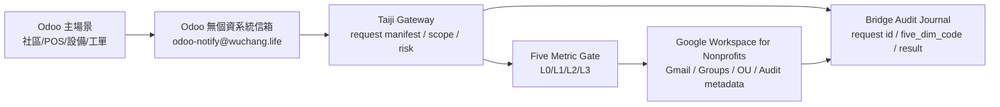

# Taiji Hub Odoo 接 Google for Nonprofits 信箱橋接規格

版本：0.1  
日期：2026-05-11  
狀態：manifest-only，未執行 live 設定  
分類：非敏感 Odoo/Google Workspace 整合規格

## 目的

本文件定義如何以 `wuchang.life` Google 非營利組織資源，將 Odoo 接上組織信箱與無敏帳戶權限管理。Odoo 仍是社區/POS/設備/工單的主場景系統；Google Workspace 只提供免費非營利信箱、群組、OU、權限 policy 與 audit metadata，不保存 Odoo 個資或會員明文。

本輪只建立規格與 manifest，不登入 Google、不呼叫 Admin/Gmail API、不修改 Odoo production、不輸出 service account JSON、OAuth token、password 或 private key。

## 免費資源基準

依 Google 官方資料，符合資格的非營利組織可使用 Google Workspace for Nonprofits：

- `Google Workspace for Nonprofits`：$0 USD / user / month。
- 提供自有網域的 professional email address。
- 包含 Gmail、Drive、Meet、Calendar、Chat、Docs、Sheets、Slides、Forms、Sites 等工具。
- Google 官方頁面也列出 Business / Enterprise 非營利折扣，但 Enterprise 是折扣，不是免費；因此本規格預設採免費 Nonprofits 方案，不把 Enterprise 作為預設。

## 推薦架構



## 建議信箱與群組

以下為建議，不代表已建立。

| 用途 | 建議地址/群組 | 類型 | 個資限制 |
| --- | --- | --- | --- |
| Odoo 系統通知寄件 | `odoo-notify@wuchang.life` | user 或 group alias | 不含會員明文 |
| Odoo noreply | `odoo-noreply@wuchang.life` | alias | 不收敏感回覆 |
| Odoo bounce | `odoo-bounce@wuchang.life` | routing/bounce | 不保存信件本文到 AI |
| Odoo audit notice | `odoo-audit@wuchang.life` | group | 只收非敏 audit 摘要 |
| POS device group | `pos-devices@wuchang.life` | group | 只保存 device label |
| Display device group | `display-devices@wuchang.life` | group | 只保存 display label |

## SMTP 方案比較

| 方案 | 說明 | 優點 | 風險/限制 | 建議 |
| --- | --- | --- | --- | --- |
| A. Google SMTP relay | Odoo 或 Linux relay 送至 `smtp-relay.gmail.com` | 官方建議給設備/應用寄信；可用 IP 或 SMTP auth | 需 Google Admin 設定；IP auth 需穩定 egress；不得用個資內容 | 第一候選 |
| B. Linux Postfix smart host | Odoo 送本機 Linux Postfix，再轉 Google SMTP relay | 適合 Linux-first、可集中 audit | 需額外維護 Postfix；本輪不執行 | 第二候選 |
| C. Gmail API send | 經 Gateway/OAuth 後呼叫 Gmail API | 可細緻 audit | 目前 live API 禁止；scope 高風險 | 暫不採用 |
| D. 使用個人 Gmail SMTP 密碼 | Odoo 直接用帳密 | 快速 | 不符合最小權限與現代 Workspace 安全 | 禁止 |

## Google Admin 設定草案

需由人類管理員在 Google Admin Console 審核後手動或受控執行；AI 不自動提交。

建議 SMTP relay 規則：

- Relay host：`smtp-relay.gmail.com`。
- Port：587 with TLS，或依 Admin 設定使用 25/465/587。
- Allowed senders：優先 `Only addresses in my domains` 或 `Only registered Apps users in my domains`，避免 `Any addresses`。
- Authentication：優先指定固定 egress IP；若無固定 IP，需另設受控 SMTP auth/OAuth 路徑，不使用一般密碼。
- Require TLS：建議啟用。
- From domain：`wuchang.life`。
- Sender addresses：僅限 Odoo 無個資系統信箱。

## Odoo 設定草案

需在 Odoo UI 或設定檔中建立 outgoing mail server，但本輪不實作 live 寫入。

建議欄位：

| Odoo 欄位 | 建議值 | 備註 |
| --- | --- | --- |
| Description | `wuchang.life Google Nonprofit SMTP Relay` | 非敏名稱 |
| SMTP Server | `smtp-relay.gmail.com` | Google SMTP relay |
| SMTP Port | `587` | TLS |
| Connection Security | `STARTTLS` | 需 Google Admin 允許 |
| Username/Password | 留空或走受控 SMTP auth | 不把密碼寫入 repo |
| From Filter | `@wuchang.life` 或指定 Odoo 系統信箱 | 防止冒用寄件 |
| Priority | 高於測試 server | 啟用前需 sandbox |

## 無個資信件規則

Odoo 寄信只允許：

- 工單代號。
- 設備代碼。
- POS 事件代碼。
- 付款狀態代碼，但不含卡號/帳號/個資。
- audit 摘要。
- 使用者需登入 Odoo 才能看到詳情的連結。

Odoo 寄信禁止：

- 會員姓名、電話、地址全文。
- 身分證件號。
- 信用卡、銀行帳號、付款敏感資訊。
- Google 私人資料。
- ChatGPT/Odoo 對話原文。

## 雲地自動帳戶與日誌

Odoo 到 Google 的橋接必須透過自動帳戶 manifest 與 audit journal：

```yaml
bridge_event:
  schema: taiji.cloud_local_auto_account_bridge.v1
  source: odoo
  target: google_workspace
  domain: wuchang.life
  five_dim_code: "D1:D2:D3:D4:D5"
  mailbox: odoo-notify@wuchang.life
  data_boundary: no_personal_data
  action: smtp_relay_send_manifest
  google_live_api_called: false
  secret_material_included: false
  audit_required: true
  rollback: disable_odoo_outgoing_mail_server_or_revert_manifest
```

## 會員五維碼申請 Odoo 信箱與 Google 論壇會員

會員可憑本會發給之五維碼，透過會員 AI 端提出以下申請：

- Odoo/Google 組織信箱申請 manifest。
- Google Workspace 論壇/群組會員註冊 token。
- 本人 audit receipt 查詢。

五維碼只代表權益狀態、資格分窗、服務窗口與 audit reference，不保存個資明文，也不得可逆查回自然人資料。

流程必須是：

```text
會員 AI 端 → 五維碼白名單檢查 → Taiji Gateway → Five Metric Gate → Odoo request manifest → 人類管理員審核 → Google Workspace 受控執行 → audit receipt
```

會員 AI 端不得直接呼叫 Google Admin SDK、Gmail API、Odoo production write、付款或高權限管理功能。

Google Workspace API 使用原則：

- Admin SDK Directory API 僅可於人類審核後，用於使用者、別名、群組/論壇會員等無敏帳戶 metadata 管理。
- Gmail API 預設不作帳號 provisioning；若用於 Odoo 通知，只允許 send-only 類用途，不讀 Gmail 本文。
- Domain-wide delegation 屬高風險條件功能，不作日常捷徑；必須有重大必要、最小 scope、獨立專案、Gateway preflight 與超管人類審核。

對應 manifest：

`Taiji_Governance/integrations/member_five_code_odoo_google_provisioning_manifest.json`

## 方案影響評估

| 面向 | 評估 |
| --- | --- |
| 公益 | 可用免費非營利信箱降低社區系統維運成本 |
| 成本 | 免費 Workspace for Nonprofits 可作預設；固定 IP/Postfix 可能另有維運成本 |
| 風險 | SMTP relay 若設定過寬可能被濫用；Odoo 信件若含個資會變 L3 |
| 權限 | Google 只處理無敏信箱與群組/OU metadata，不碰 Odoo 場景明文 |
| 回滾 | 停用 Odoo outgoing mail server、停用 relay rule、撤回 manifest |
| 稽核 | 每次橋接需寫入 request id、five_dim_code、sender、result、hash |

## 第一階段安全落地

1. 建立本 manifest。
2. 由人類管理員在 Google Admin Console 準備 Odoo 系統信箱與 SMTP relay rule。
3. 在 Odoo sandbox 建立 outgoing mail server。
4. 只寄送無個資測試信。
5. 寫入 bridge audit。
6. 通過 Five Metric preflight 後，才考慮 production 啟用。

## 明確禁止

- AI 自動登入 Google Admin Console 修改設定。
- AI 讀取或輸出 Workspace 密碼、OAuth token、service account JSON。
- Odoo 使用個人 Gmail 帳號寄信。
- Odoo 信件包含會員明文或付款敏感資訊。
- 未經 audit 的雲地自動帳戶橋接。
