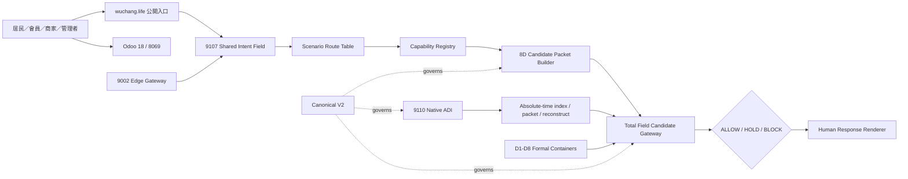

# W7TP 總場系統白皮書

STATE=W7TP_SYSTEM_WHITEPAPER
VERSION=2026-07-22
LANG=zh-TW
SCOPE=LOCAL_ENGINEERING_WHITEPAPER_WITH_LIVE_HEALTH_BASELINE
EVIDENCE_SNAPSHOT=2026-07-22T22:05:40Z
CANONICAL_REF=docs/total_field/W7TP_8D_MULTIPURPOSE_GENERATIVE_TRANSMISSION_PACKET_CANONICAL_V2.md
CANONICAL_SHA256=a5281f229ced0943072cce373125be16f0d361b9352a71094ad5450a6022d5d0

> 2026-07-22 更新聲明：W7TP 的技術定義以 Canonical V2 為唯一依據。D1–D8 固定為 Intent、State、Coordinate、Evidence、Execution、Generative Transmission、Risk、Envelope。ADI 是索引與重構實作能力，不是第九維度，也不是獨立裁決權威。本文件第 21 節以後是本次 live evidence 更新；涉及目前運行狀態時，以該部分為準。

## 摘要

W7TP 是一個本地優先、候選先行、權威分離的總場系統。它把自然語言入口轉成可驗證的 state-field packet，經由 ADI 5D 絕對索引、lookup / reference / reconstruction conditions、7D 功能狀態生成、8D 權威封套、canonical verifier 與 Total Field gate 之後，再輸出可被 LINE / Web / Odoo 使用的安全自然語言回覆。

這個系統不是一般聊天機器人，不是檔案搬運工具，也不是雲端同步代理。它的核心任務是：把可執行意圖、狀態、證據、風險與權限切成可治理的封包，讓 AI 只做候選生成，讓本地總場與 verifier 做最終准駁。

本白皮書以目前 repo 內已驗證的模組為基礎，整理出一個可交付、可審計、可持續迭代的工程總圖。它適合作為 startup 團隊的主架構說明，也適合作為產品、後端、驗證、營運、通道整合之間的共同語言。

## 1. 系統定位

W7TP 的定位可以用一句話定義：

> 自然語言進來，候選先產生，ADI 5D 先索引，7D 先組態，8D 先封套，canonical verifier 先裁決，Total Field gate 先封印，最後才交給人類可讀回覆。

系統的三個基本原則：

1. AI 只能當 candidate generator，不能當 authority source。
2. 通道只能當 entry / response channel，不能當決策來源。
3. 總場驗證與封印必須在本地完成，雲端只能提供候選與算力。

## 2. 問題定義

一般聊天式系統有三個典型失敗點。

第一，模型直接回答，沒有可驗證的中介層，導致權威與輸出綁在一起。

第二，輸入一旦稍微複雜，就會把意圖、狀態、風險、證據、權限混成一團，最後只能靠提示詞修補。

第三，通道常常被誤用成權威，例如把 LINE、Web、Odoo、雲端同步、檔案搬運、備份還原當成業務真實，結果是定義漂移與邊界外移。

W7TP 的設計，就是把這三個問題拆開。

## 3. 設計承諾

本系統不變的承諾如下：

| 承諾 | 說明 |
| --- | --- |
| 候選先行 | 先產生 candidate packet，再進 verifier。 |
| 權威分離 | 模型、通道、查表層都不是最終權威。 |
| 對話可帶情緒 | 保留自然語言與情境語氣，但禁止用「會話能力」取代總場授權。 |
| 擬人化可辨識 | 對話必須可被使用者感知為有溫度的助手，而非純規則回覆。 |
| ADI 5D 絕對索引 | ADI 5D 是 canonical 5D，不是神經網路，不是普通五欄 JSON，也不是外掛張量網。 |
| 7D 功能狀態 | 7D 負責可執行狀態組合與等價效果生成。 |
| 8D 權威封套 | 8D 負責權限、TTL、nonce、hash、風險、驗證與封印。 |
| 總場驗證 | 最終 ALLOW / HOLD / BLOCK 由本地 gate 決定。 |
| 人類可讀回覆 | 使用者只看到安全回覆，不看到 raw D1-D8 內部結構。 |
| 定義不漂移 | GT 不能被偷換成 file transfer、cloud sync、backup 或 download-decrypt restore。 |

## 4. 端到端資料流

```text
自然語言入口
-> Chat Adapter
-> AI candidate lane
-> 8D+7D state-field packet
-> ADI 5D absolute index
-> lookup / reference / reconstruction conditions
-> 7D functional state generation
-> 8D authority envelope
-> canonical verifier
-> Total Field gate
-> Human Response Renderer
-> LINE / Web / Odoo natural language reply
```



```mermaid
flowchart LR
    A[自然語言入口] --> B[Chat Adapter]
    B --> C[AI candidate lane]
    C --> D[8D+7D state-field packet]
    D --> E[ADI 5D absolute index]
    E --> F[lookup / reference / reconstruction conditions]
    F --> G[7D functional state generation]
    G --> H[8D authority envelope]
    H --> I[canonical verifier]
    I --> J[Total Field gate]
    J --> K[Human Response Renderer]
    K --> L[LINE / Web / Odoo reply]
```

## 5. 分層架構

| 層 | 角色 | 權威性 | 輸出 |
| --- | --- | --- | --- |
| Chat Adapter | 接收自然語言與通道 metadata | 非權威 | normalized request |
| AI candidate lane | 產生候選意圖、候選狀態、候選文案 | 非權威 | candidate packet |
| 8D+7D state-field packet | 組合意圖、狀態、證據、執行與功能狀態 | 中介層 | bounded packet |
| ADI 5D absolute index | 絕對索引與重構定位 | 中介層 | index ref |
| lookup / reference / reconstruction conditions | 決定性對應與重構條件 | 中介層 | lookup plan |
| 7D functional state generation | 生成可執行狀態組合與等價效果 | 中介層 | functional candidate |
| 8D authority envelope | TTL、nonce、hash、風險、驗證、封印 | 受控層 | sealed packet |
| canonical verifier | 判斷 schema、風險、漂移與 hard wall | 權威裁決前置層 | ALLOW / HOLD / BLOCK |
| Total Field gate | 最終產品 gate，整合 verifier 與政策 | 本地權威 | final gate result |
| Human Response Renderer | 轉為安全自然語言 | 非權威輸出層 | user reply |
| LINE / Web / Odoo | 入口與回覆通道 | 只承載 | channel output |

## 6. ADI 5D 的工程定義

ADI 5D 在這個系統裡不是一般資料欄位，也不是附加模組。它是 absolute index，作用是把 packet 的語義空間壓縮成可定位、可查表、可重構、可驗證的 canonical 索引。

ADI 5D 必須同時滿足四件事：

1. 可定位：知道 packet 在總場中的位置。
2. 可引用：lookup / reference 可以直接回到權威來源。
3. 可重構：目的端能依條件生成等價狀態。
4. 可驗證：重構結果必須能被 verifier 判定。

ADI 5D 不是神經網路，不是一般五欄 JSON，也不是外掛到 8D 外面的額外張量層。它是系統定義的一部分，必須被 canonical verifier 先檢查，再允許後續流程。

## 7. 7D 功能狀態層

7D 的責任不是靜態描述，而是功能狀態生成。它要解決的是：

1. 哪些狀態能組合成可執行候選。
2. 哪些狀態在語義上等價。
3. 哪些狀態可以透過條件重構成相同效果。
4. 哪些狀態雖然語法合法，但功能上應被 HOLD。

這一層讓系統從「看起來像對」變成「可執行且不越權」。

## 8. 8D 權威封套

8D 的角色是把候選包成一個可治理的封套。它至少包含：

| 欄位類型 | 作用 |
| --- | --- |
| nonce | 防重放。 |
| TTL | 限制有效時間。 |
| hash | 綁定 packet 完整性。 |
| risk | 定義風險級別與處理路徑。 |
| verification ref | 連到 verifier 與 audit。 |
| seal | 表示封印完成。 |

8D 的重點不是欄位數字，而是封包治理邏輯。它不是輸出格式，也不是 JSON 的欄位裝飾，而是整個系統的權限包裝層。

## 9. Canonical Verifier 與 Total Field Gate

canonical verifier 是 deterministic core。它要先做以下事情：

1. 驗證 packet schema。
2. 驗證 ADI 5D 是否存在且合法。
3. 驗證 7D functional state 是否可接受。
4. 驗證 hard risk 與定義漂移。
5. 決定 `ALLOW`、`HOLD` 或 `BLOCK`。

Total Field gate 是產品層最終 gate。它整合 verifier 結果、通道上下文、風險政策與輸出格式，形成可回覆、可審計、可追蹤的 final gate result。

決策語義如下：

| 結果 | 語義 |
| --- | --- |
| ALLOW | 低風險、結構合法、可直接回覆。 |
| HOLD | 需要補件、確認、人工判斷或定義釐清。 |
| BLOCK | 硬壁違反、權威外移、風險不可接受。 |

## 10. Human Response Renderer

Renderer 不是 verifier。它只做兩件事：

1. 把 gate result 翻成一般人看得懂的話。
2. 隱藏 D1-D8、hash、nonce、rule trace、internal refs 等內部細節。

回覆風格分成三類：

| 情境 | 生成策略 |
| --- | --- |
| 低風險 | 直接給出可執行回覆。 |
| 中風險 | 要求確認，或提示缺少條件。 |
| 高風險 | 明確 HOLD / BLOCK，說明不可做原因。 |

這一層的目標是把總場結果變成人可以採用的語言，但不洩漏內部權威機制。

### 10.1 擬人化要求（非越權）

要有情緒與特色，但邊界固定為「可理解、可提醒、可陪伴、不可代決」。

- 可以使用溫和語氣、情境化稱呼、同理句式（例如：`了解，這個需求我幫你先整理到最高安全流程`）。
- 可以主動給選項與建議（例如：`你要我先幫你整理三個版本嗎`）。
- 不可以聲稱看見真人、承諾實際授權身份、或保證可直接執行高風險操作。

### 10.2 回覆模板原則

- 低風險：直接回覆結果 + 可執行下一步建議。
- 中風險：先表示理解，再要求補件（如時間、場景、授權條件）。
- 高風險：明確拒絕，說明不可越權，並給候補安全路徑。

## 11. 通道角色

LINE / Web / Odoo 在這個系統裡只是一組入口與回覆通道。

| 通道 | 功能 | 不可做的事 |
| --- | --- | --- |
| LINE official account | 自然語言入口與訊息回覆 | 不能直接寫 DB、付款、部署、重啟 |
| Web cockpit | 觀察 packet chain 與狀態 | 不能繞過 verifier |
| Odoo | 業務流程與會員 / 店務承載 | 不能成為權威來源 |

通道可以接收候選請求，但不能成為決策本體。通道必須服從 gate result。

## 12. 定義漂移的硬壁

生成式傳輸在本系統中的定義固定為：

> 狀態場封包、引用、查表、重構條件、等價狀態生成與總場驗證。

它不是：

1. 檔案搬運。
2. 雲端密文同步。
3. 備份。
4. 下載後解密還原。

任何把 GT 偷換成上述語義的請求，都必須被 HOLD。這不是詞彙偏好，而是系統邊界。

## 13. 安全邊界

系統必守的安全邊界如下：

```text
SECRET_READ=FALSE
MEMBER_PLAINTEXT_READ=FALSE
DB_WRITE=FALSE
DEPLOY=FALSE
SERVICE_RESTART=FALSE
MODEL_AUTHORITY=FALSE
EXTERNAL_API_AUTHORITY=FALSE
FILE_TRANSFER_AS_GT_CORE=FALSE
CLOUD_SYNC_AS_GT_CORE=FALSE
BACKUP_AS_GT_CORE=FALSE
DOWNLOAD_DECRYPT_RESTORE_AS_GT_CORE=FALSE
```

其中，AI 可以產生候選，但不能讀 secret、不能直接寫 DB、不能把雲端同步說成總場核心，也不能把自己變成權威。

## 14. 已驗證的實作表面

目前 repo 內已形成的核心 surface 包括：

| 模組 | 狀態 |
| --- | --- |
| ADI 5D schema / verifier | 已落地並通過驗證。 |
| canonical 8D verifier 接入 ADI 5D | 已接入。 |
| final state gate | 已有最小落地。 |
| human response renderer | 已有最小落地。 |
| LINE official account entry | 已接通。 |
| LINE WORKS integration | 已完成整合。 |
| XiaoJ backend optimization | 已完成包裝。 |
| intent field packet framework | 已建立。 |
| public site / member recruitment | 已有對外入口表面。 |
| Odoo member POS delivery domain | 已有業務域整合。 |

這代表系統不是白紙，而是已經有實作、驗證與通道分工的可運行骨架。

## 15. 建議的 startup 團隊作業模型

如果用矽谷新創團隊的方式來運作，建議把人力分成五個責任面：

1. Principal Architect：負責不變式、層級邊界、packet contract。
2. Runtime Engineer：負責 gate、verifier、adapter、renderer。
3. Security / Verification Engineer：負責 hard wall、replay、防漂移與測試。
4. Product Engineer：負責 LINE / Web / Odoo 的回覆體驗與通道整合。
5. Ops / Release Owner：負責 manifest、audit、報告、可回溯與本地交付。

這種分工的核心不是人數，而是責任邊界。每個角色都應該能回答自己負責哪一層、哪一個輸出、哪一個失敗模式。

## 16. 主要風險與處理方式

| 風險 | 典型表現 | 處理方式 |
| --- | --- | --- |
| 定義漂移 | 把 GT 說成 file transfer 或 cloud sync | 直接 HOLD |
| 權威外移 | 讓 AI 或通道直接決策 | BLOCK 並回到 verifier |
| 結構缺失 | 沒有 ADI 5D 或 packet 不合法 | HOLD |
| 高風險動作 | DB write、deploy、restart | BLOCK |
| 內部洩漏 | 輸出 raw D1-D8、secret、nonce、rule trace | renderer 過濾 |
| 通道誤用 | 把 LINE / Web / Odoo 當權威 | 重新收斂到 gate |

## 17. 目前最合理的結論

W7TP 的最終形態不是「更聰明的聊天系統」，而是「更可治理的狀態場系統」。

它的價值不在於讓模型說得更像人，而在於讓每一次自然語言互動都能被拆成候選、索引、重構條件、功能狀態、權威封套、驗證、封印與安全回覆。

這樣做的結果是：

1. 系統可以被工程化管理。
2. 通道可以增加，但權威不會散掉。
3. AI 可以幫忙，但不會搶權。
4. 討論可以很自由，但落地一定可驗證。

## 18. 核心應用場景

### 18.1 咖啡館會員與店務日常

現有最直接的場景是上品聊國咖啡館門市服務與會員流程。

### 應用收益
- 提示詞進入變成可審計的 packet，不直接觸發 Odoo 寫入。
- 訂單建議、狀態查詢、服務解釋在可控邊界內回覆。
- 高風險動作（付款、敏感改價、權限調整）自動進 HOLD 或 BLOCK。

### 解決的舊問題
- 傳統入口往往把模型回覆當作最終真相，造成權責混淆。
- 用戶端與後台資訊常常不同步，導致重複溝通與錯誤回覆。
- 現在流程可重放、可追溯，便於事後校正。

### 18.2 商家/會員入會與關係治理

從 LINE 官方帳號、Web 表單到 Odoo 記錄，核心目標是先建立「候選 + context + gate」再進行最終授權。

### 應用收益
- 「我就是誰」型輸入會先進入 CLAIMED context，不直接轉為真實身份。
- 符合資歷、角色、scope 的會員才能進入後續流程。
- 入口與回覆仍能服務，授權落在總場，防止權限外移。

### 解決的舊問題
- 以自稱身份作為授權來源的風險下降。
- 會員明文與敏感上下文不被 chat 層直接讀取。
- 一句對話能被轉成可驗證的審批事件，而非口頭決策。

### 18.3 組織治理與社區服務

在協會、社區服務或流程協作場景，系統可承載任務轉交、狀態更新、進度解釋。

### 應用收益
- 通知、流程查詢、流程狀態回報以同一總場鏈路回覆。
- 每個關鍵步驟都帶可查的風險碼與封鎖原因，便於跨角色協作。
- 將「會議口頭決議」轉成可追溯的判斷基礎。

### 解決的舊問題
- 非結構化溝通造成的版本漂移可被降低。
- 不同通道對同一流程給出不一致結果的情況減少。
- 仍保留人工補正節點，避免錯誤全自動推進。

### 18.4 開發、維運與擴充開發

產品與工程在本地可快速驗證新場景需求而不觸碰生產風險。

### 應用收益
- 開發人員可以在 local pipeline 驗證 candidate flow 與 gate 行為。
- 通道整合不必每次都重新定義權威邏輯。
- 可快速複用 schema、verifier 與 renderer 測試樣式。

### 解決的舊問題
- 「加一個新入口」時，權限與審查邏輯易被複寫。
- 高風險動作常在測試後才被發現，現在可提前 HOLD 檢查。
- 可維持「不改高風險底線」的增量交付節奏。

## 19. 目前未能解決的問題

### 19.1 還不能完整替代人工的高風險決策

- 高風險交易、付款流程、敏感資料核對仍需人工決策回路。
- 低品質輸入仍會進入 HOLD，需補充補件與人機協作回路。
- 當輸入過於模糊時，仍無法保證一次對話就能完成。

### 19.2 生態全域整併仍有缺口

- 全服務容器化與某些 Odoo 深度整合仍在補齊中。
- 5D/7D 與更完整交易場景的產線覆蓋不足。
- 可視化與告警儀表盤尚未覆蓋所有高頻路徑。

### 19.3 不能一概而論「已全部商業化」

- 目前以治理與可用性為主，未必同時具備完整營運規模化的 SLA。
- 遭遇極端複雜流程時仍需人工切割路由與上下文策略。
- 仍需持續對接外部候選算力節點的可追溯 report format。

### 19.4 對應解方

- 以 P0/P1/P2 分流管理「已可商用」與「仍需人工把關」的能力邊界。
- 針對每個新場景定義 HOLD 觸發條件與 renderer 提示語。
- 保持通道簡潔，讓新增需求只加在 canonical chain，不改權威邏輯。

### 19.5 馬上可解的最短方法

最短、最快、立即落地的方式是先把「門檻」前置，而不是先追求完整功能擴充。

1. 先鎖住一條決策規則：**缺 ADI 5D 或 candidate 結構不合法時一律 HOLD**。
2. 只保留三類輸出：`ALLOW / HOLD / BLOCK`，其餘高風險直接 BLOCK，不先做多版本對話策略。
3. LINE / Web / Odoo 回覆只顯示安全文本，不顯示 verifier 內部字段。
4. 每次新通道需求只做「接收 -> 轉換為 packet -> canonical verifier -> gate -> renderer」，不新增額外權限來源。
5. 先補 3 組可重用測試關卡：缺欄位、定義漂移、DB寫入/部署/重啟請求，其他場景先 HOLD。

這樣可以立刻把「可用但不漂移」打穩，後續再慢慢擴充長尾能力。

### 19.6 當下可衍生的能力

在不改變核心邏輯邊界下，最短方法下可立刻衍生以下功能：

- 先導通用回覆模板庫：依 scene/context 給出一致 wording，不洩漏內部決策。
- 先導入共用風險碼對映：把 `HOLD/BLOCK` 原因規格化為固定分類（定義漂移、缺 ADI、權限不足、雲端邊界違反）。
- 先建立票據化待處理清單：每個 HOLD 都產生可追蹤 ref，給客服或人工後台一份待辦清單。
- 先做共用事件摘要（不含敏感欄位）：輸出可稽核摘要供後續日誌、運維、驗證使用。
- 先實作小型通道適配器模式：LINE/Web/Odoo 共用 adapter 介面，減少通道差異帶來的決策分歧。
- 先補上「一行級」告警規則：只對高風險句式、明顯缺欄位、重複風險語義進行 prompt/告警提示。
- 先導入簡單的 A/B 路徑管理：同一個需求只變更候選條件，不變更 verifier 與 gate 的權威邏輯。

## 20. 結語

如果把這個系統看成 startup 產品，它不是一個單一功能，而是一個可擴張的總場治理底座。

如果把它看成工程架構，它不是 prompt 技巧，而是從自然語言到封印回覆的完整決策鏈。

如果把它看成團隊協作規格，它要求每個模組都尊重邊界：AI 做候選，本地 verifier 做裁決，human response 做表達，LINE / Web / Odoo 做通道。

這就是 W7TP 的白皮書級定義。

## 21. 2026-07-22 證據狀態模型

本次盤點使用五層狀態，避免把「有程式碼」直接寫成「已正式上線」。

| 狀態 | 定義 |
| --- | --- |
| `SOURCE_PRESENT` | repo 內存在可讀程式、設定或 Schema。 |
| `PROCESS_ACTIVE` | systemd 或容器程序正在運行。 |
| `ENDPOINT_PASS` | 本次 GET-only 探測取得預期 HTTP 200／健康內容。 |
| `AUTHORITY_VERIFIED` | 有可解析的 Total Field decision／receipt 與治理邊界。 |
| `CANONICAL_ACTIVE` | 既有 canonical owner、active pointer 與 release contract 全部完成切換。 |

本次總結：

```text
SYSTEM_HEALTH=DEGRADED
CORE_RUNTIME=PASS
DATA_PLANE=PASS_OBSERVED
PUBLIC_PRODUCT_SURFACE=PARTIAL
PRODUCT_ROOT_AUTHORITY=ALLOW_COMMITTED
PRODUCT_ROOT_CANONICAL_ACTIVE=HOLD_OWNER_NOT_RESOLVED
```

`DEGRADED` 的原因不是核心 9002／9107／9110／Odoo 中斷，而是公開產品路由部分為 404、Google OAuth redirect URI 不一致、舊健康清單已落後於現行端口，以及產品根尚未綁定既有 canonical owner。

## 22. 系統健康檢查

### 22.1 主機資源

| 指標 | 觀測值 | 判定 |
| --- | --- | --- |
| Uptime | 61 天 9 小時 | 穩定運行中 |
| Load average | 0.60 / 0.51 / 0.42 | 正常 |
| 記憶體 | 23 GiB，18 GiB available | 正常 |
| Swap | 4.0 GiB，使用 1.1 GiB | 可用，應觀察長期趨勢 |
| 根檔案系統 | 226 GiB，使用 117 GiB，55% | 正常 |
| User failed units | 0 | PASS |
| System failed units | 2 | `nvidia-persistenced`、`openwebui` 需釐清 |

### 22.2 核心服務與端點

| 服務 | 運行方式 | 綁定位址／端點 | 本次結果 | 說明 |
| --- | --- | --- | --- | --- |
| Taiji Edge Gateway | 現有程序 | `0.0.0.0:9002/healthz` | 200 PASS | 回報 `taiji_edge_gateway`、`w7tp_runtime`。 |
| Edge model surface | 現有程序 | `0.0.0.0:9002/v1/models` | 200 PASS | 回報一個 Wuchang-Taiji model entry；只證明介面可讀。 |
| Shared Intent Field | `w7tp-intent-field.service` | `127.0.0.1:9107/readyz` | 200 PASS | 權威 route table 與 capability registry 可讀。 |
| Intent capabilities | 同上 | `127.0.0.1:9107/capabilities` | 200 PASS | 五個 profile 可解析。 |
| Native ADI | `w7tp-native-adi.service` | `127.0.0.1:9110/health` | 200 PASS | 回報 Total Field master、production service 與 W7TP protocol。 |
| Small Agent | `w7tp-small-agent.service` | systemd active | PROCESS_ACTIVE | 本輪未呼叫會改變狀態的功能。 |
| Odoo 18 | Docker | `127.0.0.1:8069/web/login` | 200 PASS | Odoo Web runtime 可達。 |
| Odoo proxy | `odoo8070proxy.service` | `127.0.0.1:8070/web/login` | 200 PASS | 代理鏈可達。 |
| Open WebUI-facing health | 現有 8080 listener | `:8080/health` | 200 PASS | 與 system-scope `openwebui.service` failed 並存，實際 owner 待確認。 |
| D8 DB | Docker `taiji_d8_db` | `:15432` | container healthy | 資料庫容器健康；本輪未查會員或業務資料。 |
| Formal D1–D8 + core | 9 個 Docker containers | internal | 全部 healthy | 證明容器 healthcheck 通過，不等同全部產品場景驗收。 |
| Odoo PostgreSQL | Docker `wuchang_os_pg` | container 5432 | healthy | 本輪未執行 DB write。 |

`9107/health` 回傳 404 是路由名稱差異，不是服務故障；該服務的既有健康契約是 `/readyz`。同理，9002 的有效健康路徑是 `/healthz`，不是 `/health`。

### 22.3 公開網域

`https://wuchang.life/` 與 `https://wuchang.life/wuchang/intent-field` 本輪均回應 200，TLS 驗證通過。下列產品路徑回應 404：

- `/web/login`
- `/wuchang/p1`
- `/wuchang/property`
- `/wuchang/merchant`
- `/wuchang/association`
- `/wuchang/home`
- `/taiji/member/login`
- `/pos/ui`

`/google/member/login` 能進入 Google OAuth，但最終顯示 `redirect_uri_mismatch`。因此登入入口存在，OAuth 設定尚未健康。

### 22.4 舊探針與現況差異

既有 `tools/service_health_readonly.py` 取得 `1/8 OK`，但其中 8081、8091、8098、8099、11434 目前沒有 listener；9002 與 8080 又使用了錯誤路徑。這份結果應解讀為「健康清單需要更新」，不能直接解讀為現行核心只有 1/8 正常。

原始 GET-only 證據：

- `runtime/reports/service_health_readonly_20260722_220540.json`
- `runtime/reports/service_health_readonly_20260722_220540.md`

## 23. 現行邏輯架構



關鍵邊界：

1. 生成式傳輸是 protocol-native 8D intent-field packet，不是檔案搬運、雲端同步或備份。
2. L1 是封包定義完整結果時的 hash／bit-level match；L2 是任務、狀態、控制與效果等價；L3 僅是候選，必須經本地狀態機判定。
3. 模型、Web、LINE、Odoo 與外部雲只可作候選或通道，不能自行產生 Total Field authority。
4. D7 只承載真實硬風險；D8 綁定 identity、authority、TTL、nonce、hash、verifier 與 seal policy。

## 24. 核心模組詳解

### 24.1 協定、封包與權威層

| 模組 | 主要位置 | 職責 | 現況 |
| --- | --- | --- | --- |
| Canonical V2 | `docs/total_field/W7TP_8D_MULTIPURPOSE_GENERATIVE_TRANSMISSION_PACKET_CANONICAL_V2.md` | 固定 unified 8D packet、packet-carried protocol／reconstruction／verification contracts、Domain Profile、風險與經濟門檻。 | `CANONICAL_LOCKED`；SHA-256 已核對。 |
| Field Application Runtime | `tools/total_field/w7tp_field_application_runtime.py` | 讀取唯一 route table 與 capability registry，建立 deterministic candidate packet；拒絕敏感鍵與權威提升。 | SOURCE_PRESENT；9107 installed release active。 |
| Intent Field Suite | `tools/total_field/w7tp_intent_field_suite/` | packet builder、guided completion、identity projection、edge queue、GPU scheduling、drift monitoring、POS interop 與 API façade。 | SOURCE_PRESENT；部分能力由 9107 暴露。 |
| Candidate Gateway | `tools/total_field_candidate_gateway.py` | 驗證 8D-GTE profile、解析 observation domain、執行 constraint／convergence，輸出 ALLOW／HOLD／BLOCK。 | SOURCE_PRESENT；V3 receipt 已有 ALLOW／COMMITTED 證據。 |
| Final State Gate | `tools/total_field/final_state_gate.py` | 最終狀態門檻與 hard-risk 收斂。 | SOURCE_PRESENT；本輪未重跑功能測試。 |
| D8 Reviewer | `tools/total_field/w7tp_d8_reviewer_entrypoint.py` | D8 風險、detour 與 reviewer 決策入口。 | SOURCE_PRESENT；工作樹目前有既存未提交修改，本輪未碰觸。 |
| Human Response Renderer | `tools/total_field/human_response_renderer.py` | 把 gate 結果轉為不洩漏內部 refs／rule trace 的使用者回覆。 | SOURCE_PRESENT。 |

### 24.2 運行服務層

#### Shared Intent Field（9107）

既有 user service 從 content-addressed release 啟動 `w7tp_openwebui_cloud_proxy.py`。它提供 `/readyz`、`/capabilities` 與候選處理入口；route table 固定 `ASSOCIATION`、`PROPERTY`、`CAFE_POS`、`HOUSEHOLD`、`GENERIC` 五個 profile，capability registry 本輪讀得 9 筆能力。服務以 loopback 綁定、systemd hardening 啟動，repo 僅允許寫入 `runtime/cloud_proxy`。

#### Native ADI（9110）

`SpacetimeADI` 以 absolute integer time slot 建立 append-only bucket，碰撞使用 Founder-native center-out spiral ordinal。核心提供 deterministic canonical JSON／SHA-256、insert、range search、packet、reconstruct、snapshot 與事件鏈。HTTP 面提供：

- `GET /health`
- `GET /metrics`
- `POST /v1/adi/insert`
- `POST /v1/adi/search`
- `POST /v1/adi/packet`
- `POST /v1/adi/reconstruct`

它拒絕非 JSON type、非有限數、raw credential key、過大 payload、append-only 衝突與完整性不一致。服務只綁 `127.0.0.1:9110`，state directory 是唯一可寫區。

#### Edge Gateway（9002）

Edge Gateway 提供 OpenAI-compatible model discovery 與 W7TP runtime health。它是入口與路由面，不是 Canonical 或 Total Field authority。`/healthz` 與 `/v1/models` 本輪均正常。

#### Formal D1–D8 containers

`w7tp_true8d_formal_d1` 至 `d8` 與 `w7tp_true8d_formal_total_field_core` 共九個容器全部 healthy。它們用於維度分工與 formal contract 驗證；container health 不代表產品根已完成 canonical promotion。

#### Small Agent

`w7tp-small-agent.service` 由既有 release symlink 啟動，systemd 顯示 active。它是受治理的小型執行代理，不能繞過 Total Field gate。本輪未驗證其所有行為路徑。

### 24.3 二級輕雲、身分與節點適配

| 模組 | 位置 | 職責與限制 |
| --- | --- | --- |
| Secondary Cloud Runtime | `runtime_adapters/w7tp_secondary_cloud_runtime.py` | 拉取 capability packet、本地重構與比較；credential 未配置時 HOLD，禁止自動雲端呼叫。 |
| taiji01 Metric Identity Gateway | `runtime_adapters/taiji01_metric_identity_gateway.py` | IP／allowlist／hash 授權、模型請求阻擋、audit 與 secondary-cloud runtime 接入。 |
| Identity Projection | `tools/total_field/w7tp_intent_field_suite/identity_projection.py` | 只投影 identity／role／consent 等 refs，不把會員明文當權限。 |
| Node Inventory | `tools/total_field/w7tp_intent_field_suite/node_inventory.py` | 描述節點與能力狀態；節點可達不等同取得執行權。 |
| Edge Queue | `tools/total_field/w7tp_intent_field_suite/edge_queue.py` | 本地候選排隊與狀態隔離。 |
| GPU Scheduler | `tools/total_field/w7tp_intent_field_suite/gpu_scheduler.py` | 候選算力排程；GPU 服務失敗時不可把模型結果提升為權威。 |
| Pull Packet Architecture | `docs/total_field/W7TP_PULL_PACKET_NATIVE_SECONDARY_CLOUD_ARCHITECTURE.md` | 固定「資料不離場、能力封包進場」及 `PULL_PACKET_ONLY` 邊界。 |

### 24.4 Odoo 18 業務模組

Odoo 與 PostgreSQL 容器目前運行，但本輪沒有讀取 DB 內已安裝模組清單。因此下表的 `SOURCE_PRESENT` 只代表 addon 原始碼與 manifest 存在，不代表該模組已在 production database 安裝或升級。

| Addon | 功能 | 主要模型／介面 | 狀態 |
| --- | --- | --- | --- |
| `pm3_base` | PM3 治理基底與封包歷史。 | `pm3.packet.history` | SOURCE_PRESENT |
| `pm3_runtime_sync` | runtime sync、memory index、去敏儀表資料與登入橋接。 | `pm3.memory.index`、LINE／Google auth routes | SOURCE_PRESENT |
| `taiji_member_login` | Odoo 登入頁的 Taiji／Wuchang 會員狀態入口。 | `/taiji/member/status`、`/taiji/member/login` | SOURCE_PRESENT；公開 route 404 |
| `wuchang_member_registration` | privacy-first 入會、同意 ledger、外部身份 ref、團體入會、復原與券計畫。 | 11 個業務模型；`/wuchang/member/register/*` | SOURCE_PRESENT |
| `wuchang_google_member_login` | Google OAuth 會員入口。 | login／callback／welcome routes | SOURCE_PRESENT；live OAuth redirect mismatch |
| `wuchang_line_login` | LINE OAuth 身分連結。 | `wuchang.line.user`、login／callback | SOURCE_PRESENT；live 未驗證 |
| `wuchang_cafe_ai_gateway` | 咖啡館 AI／POS 行為 eventbook、結帳 preflight、KPI、品質與候選通知。 | 14 個治理／候選模型；小J ordering／payment／receipt APIs | SOURCE_PRESENT；live 安裝未驗證 |
| `wuchang_cafe_menu_options` | 菜單規格化、選項群組、價差、問題與虛擬變體，不依賴 product variant 爆炸。 | 6 個 menu option models | SOURCE_PRESENT |
| `wuchang_pos_topology` | 分離不同店點／公益分支的 POS 拓樸與治理。 | POS configuration extension | SOURCE_PRESENT |
| `wuchang_core` | 統一社區應用核心，涵蓋 AI agent、治理、設備、物業、志工、菜單、訂單、看板與稽核。 | 77 個 Python files、70+ model names、多組 public／user routes | SOURCE_PRESENT；應分域審查，不等同全部 live |
| `wuchang_property_local_cloud` | 會員主權型本地設備、permission proof、trusted node、franchise 與 field verification。 | 11 個 property／device／proof models | SOURCE_PRESENT |
| `wuchang_property_manpower_surface` | 社區物業人力面與預算計畫。 | plan、line models | SOURCE_PRESENT |
| `wuchang_wish_tree_coin` | 社區許願樹公益幣週期、ledger、policy 與核准 target。 | 4 個治理模型 | SOURCE_PRESENT |
| `wuchang_fund_allocation` | 基金收入分配 ledger。 | `wuchang.fund.allocation.ledger` | SOURCE_PRESENT；其 manifest 依賴的 `wuchang_fund_reserve` 未在本次 examined addon root 找到 |
| `wuchang_knowledge_sync` | 將既有知識來源建立安全索引。 | knowledge source／item | SOURCE_PRESENT；路徑與 runtime binding 待確認 |

### 24.5 網站與通道

| 通道 | 角色 | 本次狀態 |
| --- | --- | --- |
| `wuchang.life` | 公開入口與社區產品門面 | 根頁 200；部分產品路由 404 |
| `/wuchang/intent-field` | 公開 Intent Field 入口 | 200 PASS |
| Odoo Web | 業務後台與流程承載 | local 8069／8070 200；public `/web/login` 404 |
| Google OAuth | 外部身份入口 | 可跳轉，但 redirect URI mismatch |
| LINE | 候選入口與回覆通道 | 原始碼存在；本輪未發送訊息或執行 live OAuth |
| Caddy identity projection config | Odoo forward-auth 後把 ref-only headers 送往 9107 | source candidate 存在；本輪未把 source existence 當 live wiring proof |

## 25. 產品根與正典狀態

產品根 `ROOT_IMPL_20260722T211410Z` 的 root packet SHA-256 是 `a073f824d77e89b024f8f43415af857272e8a59d6f6de8b518ee1aba90971a3d`。V3 gateway receipt SHA-256 是 `2156d81a2b7fe5674e24b3846cf154cbe85e0538f8109f26493c51e95db5ef58`，內容證明：

- `TOTAL_FIELD_DECISION=ALLOW`
- `GATEWAY_LIFECYCLE=COMMITTED`
- `GATEWAY_COMMIT_APPLIED=true`
- `D7_REFERENCE_ONLY=PASS`
- `OBSERVATION_DOMAIN_CALLER_BINDING=PASS`

但現有 master-index active pointer 是另一個 `m1_m36.gt_8d_pointer.v1` 封包，既有 promotion producer 又只擁有 TFCT runtime policy scope；Native ADI release 沒有可把該產品根反向解析為 release 的 manifest。因此目前是：

```text
AUTHORITY_DECISION=ALLOW_COMMITTED
CANONICAL_PROMOTED=false
DEPLOYED=false
STATE=HOLD_EXISTING_CANONICAL_OWNER_NOT_RESOLVED
```

這是治理／release ownership 缺口，不是 9110 runtime 故障。

## 26. 資料、身份與權限邊界

1. 會員、居民、商家與管理者身份以 ref-only projection 進入封包；明文身份資料留在授權業務系統。
2. `member_ref`、登入成功或管理員核准都不能自動推導跨會員 consent。
3. Candidate Gateway 接受候選，不接受模型自帶的 `ALLOW`、`commit_applied=true` 或權威結果。
4. Total Field receipt、Founder authorization、canonical promotion、release deployment 是四個不同層級；任何一層不能代替其他層。
5. DB、會員資料、會計資料、router 與服務重啟必須有精確 Owner scope；健康檢查不得寫入這些面。
6. 健康端點只回傳非敏感 service state，不應回傳 secret、raw member data 或 credential。

## 27. 主要風險與修正優先序

| 優先 | 風險 | 證據 | 建議處置 |
| --- | --- | --- | --- |
| P0 | Product root canonical owner 未解析 | cutover evidence 為 HOLD | 在既有 master index／release owner 中定義單一 product-root contract，完成前不建立第二套 pointer。 |
| P0 | 公開 Google 登入失敗 | `redirect_uri_mismatch` | 核對 Google Console 已登記 redirect URI 與實際 callback；變更前保存設定證據。 |
| P1 | 公開產品路由不完整 | 多個 `/wuchang/*`、member、POS routes 為 404 | 逐條核對實際產品 owner、Odoo 安裝狀態與 ingress mapping，不以 source route 冒充 live route。 |
| P1 | 健康清單落後 | 既有工具僅 1/8 OK，但現行核心端點皆可達 | 更新既有 `service_health_readonly.py` targets，保留 9002 `/healthz`、9107 `/readyz`、9110 `/health`、8069／8070、8080 `/health`。 |
| P1 | system unit 與實際 8080 health 不一致 | `openwebui.service` failed，但 8080 PASS | 查清 8080 的真正 process／release owner，移除或修復殘留 unit，避免監控誤報。 |
| P1 | GPU persistence failed | `nvidia-persistenced.service` failed | 只有在 GPU workload 被 release manifest 宣告為必要時才修復；不要為健康分數盲目重啟。 |
| P2 | Odoo source 與 live 安裝狀態未對齊 | addon 原始碼存在，但本輪未查 installed modules | 建立只讀 installed-module inventory 與 route smoke matrix。 |
| P2 | Addon dependency 缺口 | `wuchang_fund_allocation` 依賴項未在 examined root 找到 | 解析依賴來源，未解析前維持不可安裝判定。 |

## 28. 建議運維基線

日常健康檢查應分成四組，而不是只用單一總分：

1. **Process**：systemd active、container healthy、無反覆 restart。
2. **Protocol**：9002 `/healthz`、9107 `/readyz`、9110 `/health` 回傳預期 schema。
3. **Product**：公開根頁、Intent Field、Odoo、會員登入、OAuth callback 與 POS 路由逐一驗證。
4. **Governance**：Canonical hash、active pointer、receipt reverse resolution、release manifest 與 rollback point 可解析。

只有四組都 PASS，才能宣告整體 production health PASS。現況是 Process／Protocol 大致 PASS，Product PARTIAL，Governance 因 product-root owner unresolved 而 HOLD。

## 29. 本次檢查邊界與證據

本次只執行 GET、systemctl status/list、Docker list、socket list、檔案讀取、SHA-256 與靜態原始碼盤點。未執行：

- service restart／daemon-reload
- deploy／release symlink 切換
- DB write／migration／Odoo module upgrade
- router write／firmware update
- POST 業務請求
- 完整 pytest、benchmark 或既有 convergence 重跑
- 會員、居民、商家或會計明文查詢

健康結果是 2026-07-22 的時間點證據，不是永久 SLA 保證。
