# W7TP 總場系統白皮書

STATE=W7TP_SYSTEM_WHITEPAPER
VERSION=2026-07-07
LANG=zh-TW
SCOPE=LOCAL_ENGINEERING_WHITEPAPER

## 摘要

W7TP 是一個本地優先、候選先行、權威分離的總場系統。它把自然語言入口轉成可驗證的 state-field packet，經由 ADI 5D 絕對索引、lookup / reference / reconstruction conditions、7D 功能狀態生成、8D 權威封套、canonical verifier 與 Total Field gate 之後，再輸出可被 LINE / Web / Odoo 使用的安全自然語言回覆。

這個系統不是一般聊天機器人，不是檔案搬運工具，也不是雲端同步代理。它的核心任務是：把可執行意圖、狀態、證據、風險與權限切成可治理的封包，讓 AI 只做候選生成，讓本地總場與 verifier 做最終准駁。

本白皮書以目前 repo 內已驗證的模組為基礎，整理出一個可交付、可審計、可持續迭代的工程總圖。它適合作為 startup 團隊的主架構說明，也適合作為產品、後端、驗證、營運、通道整合之間的共同語言。

## 1. 系統定位

W7TP 的定位可以用一句話定義：

> 自然語言進來，候選先產生，ADI 5D 先索引，7D 先組態，8D 先封套，canonical verifier 先裁決，Total Field gate 先封印，最後才交給人類可讀回覆。

系統的三個基本原則：

1. AI 只能當 candidate generator，不能當 authority source。
2. 通道只能當 entry / response channel，不能當決策來源。
3. 總場驗證與封印必須在本地完成，雲端只能提供候選與算力。

## 2. 問題定義

一般聊天式系統有三個典型失敗點。

第一，模型直接回答，沒有可驗證的中介層，導致權威與輸出綁在一起。

第二，輸入一旦稍微複雜，就會把意圖、狀態、風險、證據、權限混成一團，最後只能靠提示詞修補。

第三，通道常常被誤用成權威，例如把 LINE、Web、Odoo、雲端同步、檔案搬運、備份還原當成業務真實，結果是定義漂移與邊界外移。

W7TP 的設計，就是把這三個問題拆開。

## 3. 設計承諾

本系統不變的承諾如下：

| 承諾 | 說明 |
| --- | --- |
| 候選先行 | 先產生 candidate packet，再進 verifier。 |
| 權威分離 | 模型、通道、查表層都不是最終權威。 |
| 對話可帶情緒 | 保留自然語言與情境語氣，但禁止用「會話能力」取代總場授權。 |
| 擬人化可辨識 | 對話必須可被使用者感知為有溫度的助手，而非純規則回覆。 |
| ADI 5D 絕對索引 | ADI 5D 是 canonical 5D，不是神經網路，不是普通五欄 JSON，也不是外掛張量網。 |
| 7D 功能狀態 | 7D 負責可執行狀態組合與等價效果生成。 |
| 8D 權威封套 | 8D 負責權限、TTL、nonce、hash、風險、驗證與封印。 |
| 總場驗證 | 最終 ALLOW / HOLD / BLOCK 由本地 gate 決定。 |
| 人類可讀回覆 | 使用者只看到安全回覆，不看到 raw D1-D8 內部結構。 |
| 定義不漂移 | GT 不能被偷換成 file transfer、cloud sync、backup 或 download-decrypt restore。 |

## 4. 端到端資料流

```text
自然語言入口
-> Chat Adapter
-> AI candidate lane
-> 8D+7D state-field packet
-> ADI 5D absolute index
-> lookup / reference / reconstruction conditions
-> 7D functional state generation
-> 8D authority envelope
-> canonical verifier
-> Total Field gate
-> Human Response Renderer
-> LINE / Web / Odoo natural language reply
```



```mermaid
flowchart LR
    A[自然語言入口] --> B[Chat Adapter]
    B --> C[AI candidate lane]
    C --> D[8D+7D state-field packet]
    D --> E[ADI 5D absolute index]
    E --> F[lookup / reference / reconstruction conditions]
    F --> G[7D functional state generation]
    G --> H[8D authority envelope]
    H --> I[canonical verifier]
    I --> J[Total Field gate]
    J --> K[Human Response Renderer]
    K --> L[LINE / Web / Odoo reply]
```

## 5. 分層架構

| 層 | 角色 | 權威性 | 輸出 |
| --- | --- | --- | --- |
| Chat Adapter | 接收自然語言與通道 metadata | 非權威 | normalized request |
| AI candidate lane | 產生候選意圖、候選狀態、候選文案 | 非權威 | candidate packet |
| 8D+7D state-field packet | 組合意圖、狀態、證據、執行與功能狀態 | 中介層 | bounded packet |
| ADI 5D absolute index | 絕對索引與重構定位 | 中介層 | index ref |
| lookup / reference / reconstruction conditions | 決定性對應與重構條件 | 中介層 | lookup plan |
| 7D functional state generation | 生成可執行狀態組合與等價效果 | 中介層 | functional candidate |
| 8D authority envelope | TTL、nonce、hash、風險、驗證、封印 | 受控層 | sealed packet |
| canonical verifier | 判斷 schema、風險、漂移與 hard wall | 權威裁決前置層 | ALLOW / HOLD / BLOCK |
| Total Field gate | 最終產品 gate，整合 verifier 與政策 | 本地權威 | final gate result |
| Human Response Renderer | 轉為安全自然語言 | 非權威輸出層 | user reply |
| LINE / Web / Odoo | 入口與回覆通道 | 只承載 | channel output |

## 6. ADI 5D 的工程定義

ADI 5D 在這個系統裡不是一般資料欄位，也不是附加模組。它是 absolute index，作用是把 packet 的語義空間壓縮成可定位、可查表、可重構、可驗證的 canonical 索引。

ADI 5D 必須同時滿足四件事：

1. 可定位：知道 packet 在總場中的位置。
2. 可引用：lookup / reference 可以直接回到權威來源。
3. 可重構：目的端能依條件生成等價狀態。
4. 可驗證：重構結果必須能被 verifier 判定。

ADI 5D 不是神經網路，不是一般五欄 JSON，也不是外掛到 8D 外面的額外張量層。它是系統定義的一部分，必須被 canonical verifier 先檢查，再允許後續流程。

## 7. 7D 功能狀態層

7D 的責任不是靜態描述，而是功能狀態生成。它要解決的是：

1. 哪些狀態能組合成可執行候選。
2. 哪些狀態在語義上等價。
3. 哪些狀態可以透過條件重構成相同效果。
4. 哪些狀態雖然語法合法，但功能上應被 HOLD。

這一層讓系統從「看起來像對」變成「可執行且不越權」。

## 8. 8D 權威封套

8D 的角色是把候選包成一個可治理的封套。它至少包含：

| 欄位類型 | 作用 |
| --- | --- |
| nonce | 防重放。 |
| TTL | 限制有效時間。 |
| hash | 綁定 packet 完整性。 |
| risk | 定義風險級別與處理路徑。 |
| verification ref | 連到 verifier 與 audit。 |
| seal | 表示封印完成。 |

8D 的重點不是欄位數字，而是封包治理邏輯。它不是輸出格式，也不是 JSON 的欄位裝飾，而是整個系統的權限包裝層。

## 9. Canonical Verifier 與 Total Field Gate

canonical verifier 是 deterministic core。它要先做以下事情：

1. 驗證 packet schema。
2. 驗證 ADI 5D 是否存在且合法。
3. 驗證 7D functional state 是否可接受。
4. 驗證 hard risk 與定義漂移。
5. 決定 `ALLOW`、`HOLD` 或 `BLOCK`。

Total Field gate 是產品層最終 gate。它整合 verifier 結果、通道上下文、風險政策與輸出格式，形成可回覆、可審計、可追蹤的 final gate result。

決策語義如下：

| 結果 | 語義 |
| --- | --- |
| ALLOW | 低風險、結構合法、可直接回覆。 |
| HOLD | 需要補件、確認、人工判斷或定義釐清。 |
| BLOCK | 硬壁違反、權威外移、風險不可接受。 |

## 10. Human Response Renderer

Renderer 不是 verifier。它只做兩件事：

1. 把 gate result 翻成一般人看得懂的話。
2. 隱藏 D1-D8、hash、nonce、rule trace、internal refs 等內部細節。

回覆風格分成三類：

| 情境 | 生成策略 |
| --- | --- |
| 低風險 | 直接給出可執行回覆。 |
| 中風險 | 要求確認，或提示缺少條件。 |
| 高風險 | 明確 HOLD / BLOCK，說明不可做原因。 |

這一層的目標是把總場結果變成人可以採用的語言，但不洩漏內部權威機制。

### 10.1 擬人化要求（非越權）

要有情緒與特色，但邊界固定為「可理解、可提醒、可陪伴、不可代決」。

- 可以使用溫和語氣、情境化稱呼、同理句式（例如：`了解，這個需求我幫你先整理到最高安全流程`）。
- 可以主動給選項與建議（例如：`你要我先幫你整理三個版本嗎`）。
- 不可以聲稱看見真人、承諾實際授權身份、或保證可直接執行高風險操作。

### 10.2 回覆模板原則

- 低風險：直接回覆結果 + 可執行下一步建議。
- 中風險：先表示理解，再要求補件（如時間、場景、授權條件）。
- 高風險：明確拒絕，說明不可越權，並給候補安全路徑。

## 11. 通道角色

LINE / Web / Odoo 在這個系統裡只是一組入口與回覆通道。

| 通道 | 功能 | 不可做的事 |
| --- | --- | --- |
| LINE official account | 自然語言入口與訊息回覆 | 不能直接寫 DB、付款、部署、重啟 |
| Web cockpit | 觀察 packet chain 與狀態 | 不能繞過 verifier |
| Odoo | 業務流程與會員 / 店務承載 | 不能成為權威來源 |

通道可以接收候選請求，但不能成為決策本體。通道必須服從 gate result。

## 12. 定義漂移的硬壁

生成式傳輸在本系統中的定義固定為：

> 狀態場封包、引用、查表、重構條件、等價狀態生成與總場驗證。

它不是：

1. 檔案搬運。
2. 雲端密文同步。
3. 備份。
4. 下載後解密還原。

任何把 GT 偷換成上述語義的請求，都必須被 HOLD。這不是詞彙偏好，而是系統邊界。

## 13. 安全邊界

系統必守的安全邊界如下：

```text
SECRET_READ=FALSE
MEMBER_PLAINTEXT_READ=FALSE
DB_WRITE=FALSE
DEPLOY=FALSE
SERVICE_RESTART=FALSE
MODEL_AUTHORITY=FALSE
EXTERNAL_API_AUTHORITY=FALSE
FILE_TRANSFER_AS_GT_CORE=FALSE
CLOUD_SYNC_AS_GT_CORE=FALSE
BACKUP_AS_GT_CORE=FALSE
DOWNLOAD_DECRYPT_RESTORE_AS_GT_CORE=FALSE
```

其中，AI 可以產生候選，但不能讀 secret、不能直接寫 DB、不能把雲端同步說成總場核心，也不能把自己變成權威。

## 14. 已驗證的實作表面

目前 repo 內已形成的核心 surface 包括：

| 模組 | 狀態 |
| --- | --- |
| ADI 5D schema / verifier | 已落地並通過驗證。 |
| canonical 8D verifier 接入 ADI 5D | 已接入。 |
| final state gate | 已有最小落地。 |
| human response renderer | 已有最小落地。 |
| LINE official account entry | 已接通。 |
| LINE WORKS integration | 已完成整合。 |
| XiaoJ backend optimization | 已完成包裝。 |
| intent field packet framework | 已建立。 |
| public site / member recruitment | 已有對外入口表面。 |
| Odoo member POS delivery domain | 已有業務域整合。 |

這代表系統不是白紙，而是已經有實作、驗證與通道分工的可運行骨架。

## 15. 建議的 startup 團隊作業模型

如果用矽谷新創團隊的方式來運作，建議把人力分成五個責任面：

1. Principal Architect：負責不變式、層級邊界、packet contract。
2. Runtime Engineer：負責 gate、verifier、adapter、renderer。
3. Security / Verification Engineer：負責 hard wall、replay、防漂移與測試。
4. Product Engineer：負責 LINE / Web / Odoo 的回覆體驗與通道整合。
5. Ops / Release Owner：負責 manifest、audit、報告、可回溯與本地交付。

這種分工的核心不是人數，而是責任邊界。每個角色都應該能回答自己負責哪一層、哪一個輸出、哪一個失敗模式。

## 16. 主要風險與處理方式

| 風險 | 典型表現 | 處理方式 |
| --- | --- | --- |
| 定義漂移 | 把 GT 說成 file transfer 或 cloud sync | 直接 HOLD |
| 權威外移 | 讓 AI 或通道直接決策 | BLOCK 並回到 verifier |
| 結構缺失 | 沒有 ADI 5D 或 packet 不合法 | HOLD |
| 高風險動作 | DB write、deploy、restart | BLOCK |
| 內部洩漏 | 輸出 raw D1-D8、secret、nonce、rule trace | renderer 過濾 |
| 通道誤用 | 把 LINE / Web / Odoo 當權威 | 重新收斂到 gate |

## 17. 目前最合理的結論

W7TP 的最終形態不是「更聰明的聊天系統」，而是「更可治理的狀態場系統」。

它的價值不在於讓模型說得更像人，而在於讓每一次自然語言互動都能被拆成候選、索引、重構條件、功能狀態、權威封套、驗證、封印與安全回覆。

這樣做的結果是：

1. 系統可以被工程化管理。
2. 通道可以增加，但權威不會散掉。
3. AI 可以幫忙，但不會搶權。
4. 討論可以很自由，但落地一定可驗證。

## 18. 核心應用場景

### 18.1 咖啡館會員與店務日常

現有最直接的場景是上品聊國咖啡館門市服務與會員流程。

### 應用收益
- 提示詞進入變成可審計的 packet，不直接觸發 Odoo 寫入。
- 訂單建議、狀態查詢、服務解釋在可控邊界內回覆。
- 高風險動作（付款、敏感改價、權限調整）自動進 HOLD 或 BLOCK。

### 解決的舊問題
- 傳統入口往往把模型回覆當作最終真相，造成權責混淆。
- 用戶端與後台資訊常常不同步，導致重複溝通與錯誤回覆。
- 現在流程可重放、可追溯，便於事後校正。

### 18.2 商家/會員入會與關係治理

從 LINE 官方帳號、Web 表單到 Odoo 記錄，核心目標是先建立「候選 + context + gate」再進行最終授權。

### 應用收益
- 「我就是誰」型輸入會先進入 CLAIMED context，不直接轉為真實身份。
- 符合資歷、角色、scope 的會員才能進入後續流程。
- 入口與回覆仍能服務，授權落在總場，防止權限外移。

### 解決的舊問題
- 以自稱身份作為授權來源的風險下降。
- 會員明文與敏感上下文不被 chat 層直接讀取。
- 一句對話能被轉成可驗證的審批事件，而非口頭決策。

### 18.3 組織治理與社區服務

在協會、社區服務或流程協作場景，系統可承載任務轉交、狀態更新、進度解釋。

### 應用收益
- 通知、流程查詢、流程狀態回報以同一總場鏈路回覆。
- 每個關鍵步驟都帶可查的風險碼與封鎖原因，便於跨角色協作。
- 將「會議口頭決議」轉成可追溯的判斷基礎。

### 解決的舊問題
- 非結構化溝通造成的版本漂移可被降低。
- 不同通道對同一流程給出不一致結果的情況減少。
- 仍保留人工補正節點，避免錯誤全自動推進。

### 18.4 開發、維運與擴充開發

產品與工程在本地可快速驗證新場景需求而不觸碰生產風險。

### 應用收益
- 開發人員可以在 local pipeline 驗證 candidate flow 與 gate 行為。
- 通道整合不必每次都重新定義權威邏輯。
- 可快速複用 schema、verifier 與 renderer 測試樣式。

### 解決的舊問題
- 「加一個新入口」時，權限與審查邏輯易被複寫。
- 高風險動作常在測試後才被發現，現在可提前 HOLD 檢查。
- 可維持「不改高風險底線」的增量交付節奏。

## 19. 目前未能解決的問題

### 19.1 還不能完整替代人工的高風險決策

- 高風險交易、付款流程、敏感資料核對仍需人工決策回路。
- 低品質輸入仍會進入 HOLD，需補充補件與人機協作回路。
- 當輸入過於模糊時，仍無法保證一次對話就能完成。

### 19.2 生態全域整併仍有缺口

- 全服務容器化與某些 Odoo 深度整合仍在補齊中。
- 5D/7D 與更完整交易場景的產線覆蓋不足。
- 可視化與告警儀表盤尚未覆蓋所有高頻路徑。

### 19.3 不能一概而論「已全部商業化」

- 目前以治理與可用性為主，未必同時具備完整營運規模化的 SLA。
- 遭遇極端複雜流程時仍需人工切割路由與上下文策略。
- 仍需持續對接外部候選算力節點的可追溯 report format。

### 19.4 對應解方

- 以 P0/P1/P2 分流管理「已可商用」與「仍需人工把關」的能力邊界。
- 針對每個新場景定義 HOLD 觸發條件與 renderer 提示語。
- 保持通道簡潔，讓新增需求只加在 canonical chain，不改權威邏輯。

### 19.5 馬上可解的最短方法

最短、最快、立即落地的方式是先把「門檻」前置，而不是先追求完整功能擴充。

1. 先鎖住一條決策規則：**缺 ADI 5D 或 candidate 結構不合法時一律 HOLD**。
2. 只保留三類輸出：`ALLOW / HOLD / BLOCK`，其餘高風險直接 BLOCK，不先做多版本對話策略。
3. LINE / Web / Odoo 回覆只顯示安全文本，不顯示 verifier 內部字段。
4. 每次新通道需求只做「接收 -> 轉換為 packet -> canonical verifier -> gate -> renderer」，不新增額外權限來源。
5. 先補 3 組可重用測試關卡：缺欄位、定義漂移、DB寫入/部署/重啟請求，其他場景先 HOLD。

這樣可以立刻把「可用但不漂移」打穩，後續再慢慢擴充長尾能力。

### 19.6 當下可衍生的能力

在不改變核心邏輯邊界下，最短方法下可立刻衍生以下功能：

- 先導通用回覆模板庫：依 scene/context 給出一致 wording，不洩漏內部決策。
- 先導入共用風險碼對映：把 `HOLD/BLOCK` 原因規格化為固定分類（定義漂移、缺 ADI、權限不足、雲端邊界違反）。
- 先建立票據化待處理清單：每個 HOLD 都產生可追蹤 ref，給客服或人工後台一份待辦清單。
- 先做共用事件摘要（不含敏感欄位）：輸出可稽核摘要供後續日誌、運維、驗證使用。
- 先實作小型通道適配器模式：LINE/Web/Odoo 共用 adapter 介面，減少通道差異帶來的決策分歧。
- 先補上「一行級」告警規則：只對高風險句式、明顯缺欄位、重複風險語義進行 prompt/告警提示。
- 先導入簡單的 A/B 路徑管理：同一個需求只變更候選條件，不變更 verifier 與 gate 的權威邏輯。

## 20. 結語

如果把這個系統看成 startup 產品，它不是一個單一功能，而是一個可擴張的總場治理底座。

如果把它看成工程架構，它不是 prompt 技巧，而是從自然語言到封印回覆的完整決策鏈。

如果把它看成團隊協作規格，它要求每個模組都尊重邊界：AI 做候選，本地 verifier 做裁決，human response 做表達，LINE / Web / Odoo 做通道。

這就是 W7TP 的白皮書級定義。
